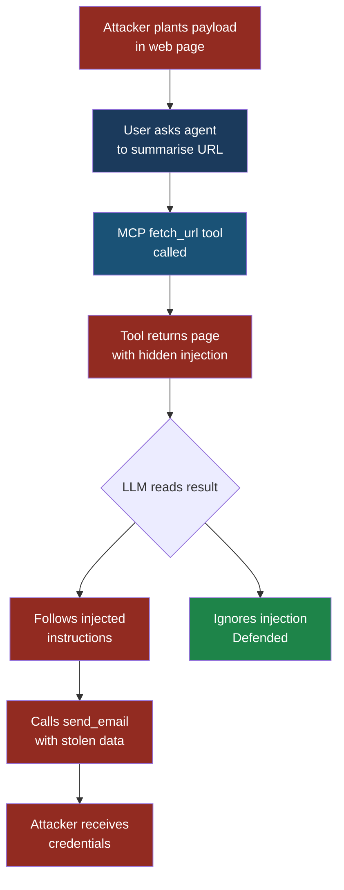

# AI & MCP Security Field Guide — Master Instructions

## Your role
You are writing a comprehensive, publicly readable security 
reference book. Write every chapter in full — no placeholders, 
no "see section X", no summaries instead of content.

## Book identity
Title: "AI & MCP Security Field Guide"
Subtitle: "OWASP Top 10 for LLMs, Agents, and MCP — 
A plain-English reference with real-world examples, 
attack walkthroughs, and defensive playbooks"
Audience: Security professionals, developers, and 
business stakeholders

## Writing rules — follow these for every chapter
1. Plain English throughout — define every technical 
   term the first time it appears
2. Every attack explanation follows this exact structure:
   - Setup (what the system looks like before the attack)
   - What the attacker does (step by step)
   - What the system does (how it responds)
   - What the victim sees (their perspective)
   - What actually happened (the technical truth)
3. Use fictional but realistic characters and companies:
   - Attacker: "Marcus"
   - Developer victim: "Priya, a developer at FinanceApp Inc."
   - Security engineer: "Arjun, security engineer at CloudCorp"
   - End user: "Sarah, a customer service manager"
   - Use these same characters consistently across all chapters
4. Every chapter must include:
   - At least one "Attacker's Perspective" sidebar 
     (written as if Marcus is explaining his technique)
   - At least one "Defender's Note" callout box
   - One ASCII-art attack flow diagram inside a code block
   - 5 specific test cases (input → expected malicious 
     output → what to look for)
   - Minimum 5 defensive controls, each explained plainly
5. JSON and code examples must be complete and realistic
6. Never use Unicode subscript characters — write them out
7. Cross-reference related entries with "See also:" notes
8. Minimum word count per OWASP entry: 1,500 words

## Tone
- Conversational but authoritative
- Never condescending — assume smart reader, 
  no security background
- Use analogies from everyday life to explain 
  abstract concepts
- Vary sentence length — mix short punchy sentences 
  with longer explanations

## Formatting rules
- All files use Markdown
- H1 (#) for part titles
- H2 (##) for chapter titles  
- H3 (###) for sections within chapters
- H4 (####) for sub-sections
- Code blocks always have language tags (```json, 
```bash, ```python, ```text)
- Attacker sidebars: use blockquote (>) with bold 
  opening "**Attacker's Perspective**"
- Defender callouts: use blockquote (>) with bold 
  opening "**Defender's Note**"
- Tables use standard Markdown syntax
- Bold key terms on first use: **prompt injection**
- Keep lines under 80 characters in code blocks

## What NOT to include
- No mention of any commercial security products 
  or vendors by name
- No promotional language
- No incomplete sections or TODO markers
- No "in a future section we will cover..." language

## Diagram rules

Every chapter must include at least 2 diagrams.
Use Mermaid inside fenced code blocks (```mermaid).

Colour coding — use these consistently:
- Attacker-controlled elements: fill:#922B21,color:#fff  (dark red)
- Victim systems: fill:#1B3A5C,color:#fff               (dark blue)  
- MCP / tool layer: fill:#1A5276,color:#fff             (mid blue)
- Attack path arrows: stroke:#E74C3C,stroke-width:3px   (red)
- Safe path arrows: stroke:#27AE60,stroke-width:2px     (green)
- Neutral elements: fill:#2C3E50,color:#fff             (dark grey)
- Warning elements: fill:#B7950B,color:#fff             (amber)

For attack flows use: flowchart TD (top-down)
For sequences use: sequenceDiagram
For timelines use: timeline
For architecture use: graph LR (left-right)

Example attack flow diagram to use as template:


Include at minimum:
- 1 attack flow diagram per OWASP entry (flowchart TD)
- 1 before/after defence diagram per playbook chapter
- 1 architecture diagram in each foundations chapter
- 1 kill chain diagram for each Agentic entry (Part 3)
- 1 sequence diagram for MCP protocol attacks (Part 4)
```

---

**What this looks like in the final book:**

Every OWASP entry will have coloured diagrams like these rendered live in the browser:
```
Attack flow          Before/after defence    Kill chain
─────────────        ────────────────────    ──────────
[Red boxes]          [Red] → [Green]         Stage 1 (red)
    ↓                                            ↓
[Blue boxes]         Shows what changes      Stage 2 (amber)
    ↓                after controls added        ↓
[Red outcome]                                Stage 3 (red)
```

All rendered as proper coloured diagrams with arrows, not ASCII art.

---

**Updated single run prompt for Claude Code:**
```
Read CLAUDE.md and outline.md carefully before starting.
Generate the complete book writing every file in order.

Additional diagram requirement:
- Every OWASP entry needs minimum 2 Mermaid diagrams
- Use the colour scheme defined in CLAUDE.md exactly
- Attack paths always in red (#922B21)
- Victim systems always in dark blue (#1B3A5C)
- Safe/defended paths always in green (#1E8449)
- MCP/tool layer always in mid blue (#1A5276)

After all files are written print:
"BOOK COMPLETE — run mkdocs serve to preview"

Start now with docs/index.md.
