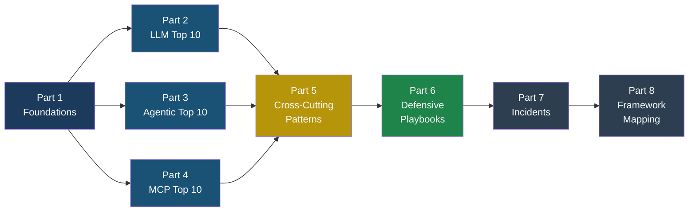

# AI Security: The Field Guide to LLMs, Agents, and MCP

## OWASP Top 10 for LLMs, Agents, and MCP — A Plain-English Reference with Real-World Examples, Attack Walkthroughs, and Defensive Playbooks

**Version:** 0.1 (Last updated: March 19, 2026)  
See: [Changelog](changelog.md)

---

## Welcome

You are holding the first security reference that covers all three layers of the modern AI stack in one place: the **large language model** itself, the **autonomous agents** built on top of it, and the **Model Context Protocol (MCP)** that connects agents to the outside world.

This book exists because these three layers create an entirely new class of security risks that traditional application security does not cover. SQL injection has a forty-year history of documented attacks and well-understood defences. Prompt injection — the equivalent attack for AI systems — has been known for less than four years, and new variants appear monthly. Agent hijacking and MCP tool poisoning are even newer, with the first documented incidents appearing only in 2024 and 2025.

If you build, deploy, secure, or make purchasing decisions about AI-powered software, this book is for you.

---

## What This Book Covers

This field guide is organized into eight parts:

**Part 1 — Foundations** explains how LLMs, agents, and MCP work in plain English. If you already know these concepts, skip ahead. If terms like "context window" or "tool call" are unfamiliar, start here.

**Part 2 — OWASP Top 10 for LLM Applications (2025)** walks through each of the ten risks identified by the OWASP Foundation for applications that use large language models. Each entry includes a realistic attack scenario, step-by-step walkthrough, test cases, and defensive controls.

**Part 3 — OWASP Top 10 for Agentic Applications (2026)** covers the ten risks specific to autonomous AI agents — systems that can plan, use tools, and take actions without human approval for every step.

**Part 4 — OWASP MCP Top 10** addresses the ten risks in the Model Context Protocol layer — the plumbing that connects AI agents to databases, APIs, file systems, and external services.

**Part 5 — Cross-Cutting Attack Patterns** dives deep into attacks that span multiple layers: indirect prompt injection, injection firewalls, and multi-agent attack chains.

**Part 6 — Defensive Playbooks** provides step-by-step guides for securing LLM applications, agent deployments, and MCP server configurations, plus a comprehensive red team checklist.

**Part 7 — Real-World Incidents Timeline** documents actual security incidents from 2023 through 2025, mapping each to the relevant OWASP entries and explaining what defences would have prevented them.

**Part 8 — Framework Mapping** provides side-by-side comparisons of all three OWASP top 10 lists, along with mappings to MITRE ATLAS and the NIST AI Risk Management Framework.

---

## How to Use This Book

### If You Are a Builder (Developer, ML Engineer, Platform Engineer)

Start with **Part 1** if you need a refresher on the technology stack. Then read the OWASP entries in **Parts 2 through 4** that match your architecture. Building a chatbot? Focus on Part 2. Building an agent with tool access? Add Part 3. Connecting through MCP? Add Part 4. Finish with the **Defensive Playbook** (Part 6) that matches your deployment.

### If You Are a Defender (Security Engineer, Penetration Tester, Red Teamer)

Go straight to the **Red Team Checklist** in Part 6 for a testing framework. Use the OWASP entries in Parts 2 through 4 as reference material when you need to understand an attack in depth. The **Cross-Cutting Attack Patterns** in Part 5 show how individual vulnerabilities chain together into full kill chains.

### If You Are an Executive (CISO, VP Engineering, Product Manager)

Read the **introduction to each OWASP entry** — the first few paragraphs of each chapter explain the risk in business terms. The **severity and stakeholder** section at the end of each entry tells you who in your organization should own the mitigation. The **Framework Mapping** in Part 8 helps you align AI security work with existing compliance frameworks.

---

## The Characters in This Book

Throughout this book, you will meet the same characters in different scenarios. This makes it easier to follow attack stories across chapters and see how the same attacker techniques evolve when applied to different targets.

| Character | Role | Description |
|-----------|------|-------------|
| **Marcus** | Attacker | A skilled but not nation-state-level attacker. He finds vulnerabilities through patience and creativity, not zero-days. He reads documentation carefully and thinks about how systems can be misused. |
| **Priya** | Developer victim | A senior developer at FinanceApp Inc. She is competent and follows security best practices — but the AI stack introduces risks that traditional security training does not cover. |
| **Arjun** | Security engineer | A security engineer at CloudCorp. He is responsible for securing AI deployments and is learning the new attack surface as fast as it evolves. |
| **Sarah** | End user | A customer service manager who uses AI-powered tools daily. She is not technical but is smart and observant — she notices when something feels wrong. |

---

## Conventions Used in This Book

Throughout this book, you will encounter several recurring elements:

> **Attacker's Perspective** — These sidebars are written from Marcus's point of view. They explain how an attacker thinks about a particular vulnerability, what they look for, and why certain defences do or do not work.

> **Defender's Note** — These callouts highlight specific defensive techniques, common mistakes defenders make, and practical advice for implementation.

**Bold terms** are used when a technical concept is introduced for the first time. Each bold term is defined in context and also appears in the Glossary.

Code blocks always include a language tag and contain complete, realistic examples — never pseudocode fragments.

---

## A Note on Responsible Disclosure

Every attack technique described in this book is already publicly documented in academic papers, security conference talks, or bug bounty reports. We describe attacks in detail because defenders cannot protect against threats they do not understand. However, we have deliberately avoided including working exploit code that could be copy-pasted against production systems. The test cases included are designed for use against your own systems in controlled environments.

---

## Acknowledgements

This book builds on the work of the OWASP Foundation's volunteer contributors who created the Top 10 for LLM Applications, the Top 10 for Agentic Applications, and the MCP Top 10. Their work in cataloguing and categorizing these emerging risks made this field guide possible.

---

**See also:** [Glossary](glossary.md) for definitions of all technical terms used in this book.

**See also:** [Appendix — Quick Reference](appendix-quick-reference.md) for one-paragraph summaries of all 30 OWASP entries.
