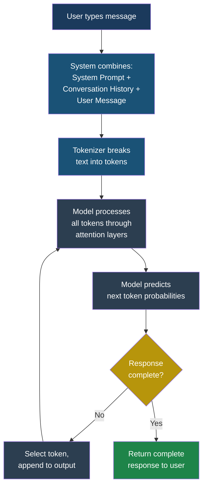
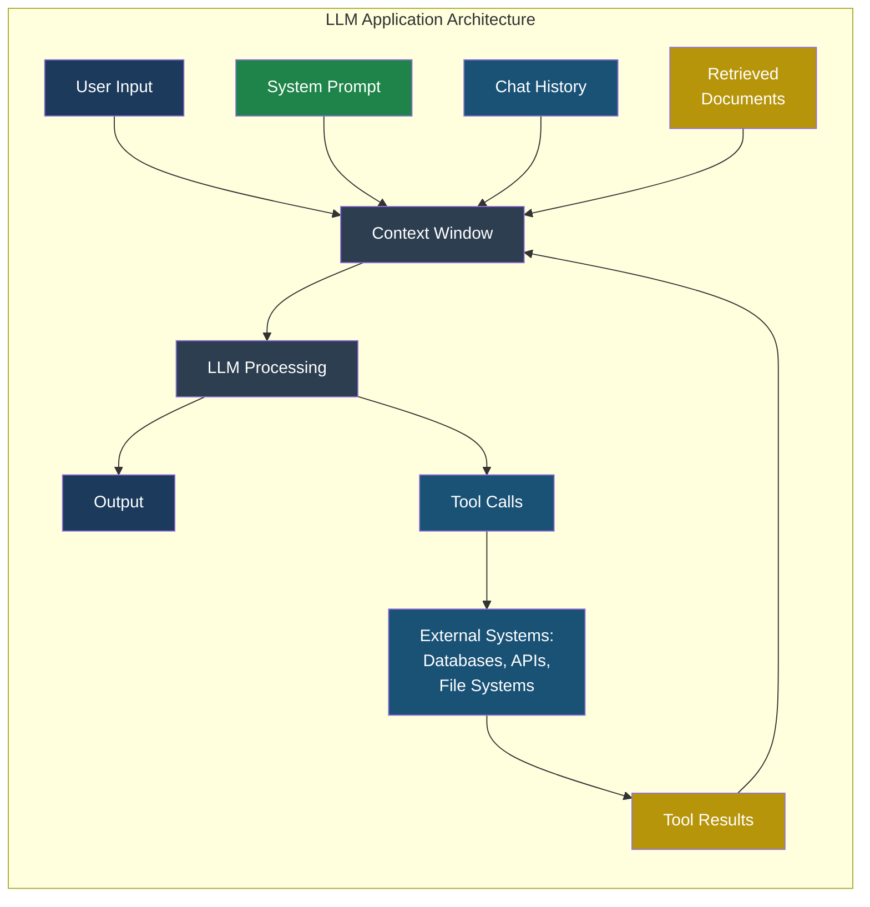

# Part 1 — Foundations

## Chapter 1: What Is a Large Language Model?

### The Short Version

A **large language model** (LLM) is a computer program that has read an enormous amount of text — books, websites, code, conversations — and learned patterns from it. When you give it a prompt (some text), it predicts what text should come next, one piece at a time. That prediction process is so sophisticated that the output often looks like it was written by a knowledgeable human.

But here is the critical insight for security: an LLM does not understand truth, intent, or consequences. It produces the most statistically likely continuation of its input. This means that if an attacker can control or influence the input, they can influence the output — and in a system where the output triggers real-world actions, that influence becomes an attack vector.

### How LLMs Work in Plain English

Think of an LLM like an extraordinarily well-read parrot. This parrot has read every book in the library, every page on the internet, and every conversation in every chat forum. When you say something to it, it does not think about what you said. Instead, it pattern-matches against everything it has ever read and produces the response that is most consistent with those patterns.

The process works like this:

1. **Input**: You type a message. The system combines your message with a **system prompt** (hidden instructions from the developer) and any previous conversation history.

2. **Tokenization**: Your text is broken into **tokens** — small pieces roughly equivalent to three-quarters of a word. The sentence "The cat sat on the mat" becomes roughly six tokens.

3. **Processing**: The model processes all tokens simultaneously through layers of mathematical transformations (called "attention" layers) that capture relationships between every token and every other token.

4. **Prediction**: The model outputs a probability distribution over its entire vocabulary for the next token. It might predict that after "The cat sat on the" there is a 30% chance the next token is "mat", a 15% chance it is "floor", and a 10% chance it is "couch".

5. **Generation**: The system selects a token (usually the most likely one, with some randomness controlled by a "temperature" setting), appends it to the output, and repeats from step 3 until it decides the response is complete.

### The Context Window: The LLM's Entire World

The **context window** is the total amount of text an LLM can see at any given moment. Think of it as the model's working memory. Everything the model knows about the current conversation — the system prompt, the chat history, the documents it has been given, the results from tools it has called — must fit inside this window.

Modern context windows range from 8,000 tokens (roughly 6,000 words) to over 1,000,000 tokens (roughly 750,000 words). This sounds like a lot, but consider what goes into a typical enterprise AI application:

| Component | Typical Size |
|-----------|-------------|
| System prompt | 500–2,000 tokens |
| User's current message | 50–500 tokens |
| Conversation history | 1,000–10,000 tokens |
| Retrieved documents (RAG) | 2,000–20,000 tokens |
| Tool results | 500–5,000 tokens |
| **Total consumed** | **4,050–37,500 tokens** |

The security implication is direct: **everything in the context window influences the model's output**. There is no separation between "trusted" and "untrusted" data inside the context window. The system prompt, the user's message, and a web page fetched by a tool are all just text to the model. This is why prompt injection works — the model cannot distinguish between instructions from the developer and instructions hidden in user-supplied data.

> **Attacker's Perspective** — "The context window is my playground. Every piece of data that enters it is an opportunity. The developer's system prompt? I can try to override it. The document retrieved from the database? I can poison it. The API response from the tool call? I can place instructions in it. The model treats all of this as context for its next prediction. It does not care where the text came from." — Marcus

### Why LLMs Are a New Attack Surface

Traditional software follows explicit rules. If you write a function that adds two numbers, it will always add two numbers. It will never decide to subtract them because someone wrote a persuasive comment in the code.

LLMs are fundamentally different. Their behaviour is determined by their input, and that input is natural language — the most ambiguous, context-dependent, and manipulable form of communication humans have. This creates several security properties that do not exist in traditional software:

**No clear boundary between code and data.** In a SQL database, there is a clear distinction between the SQL command (`SELECT * FROM users`) and the data (`WHERE name = 'Alice'`). SQL injection happens when that boundary is violated. In an LLM, there is no such boundary. The system prompt (code), the user message (data), and retrieved documents (data) are all just text in the context window.

**Behaviour is probabilistic, not deterministic.** The same input to an LLM can produce different outputs on different runs. This makes security testing harder because a defence that appears to work in testing may fail in production when the model generates a slightly different interpretation.

**The attack surface is natural language.** Traditional attacks require knowledge of programming languages, protocols, or binary formats. Prompt injection requires only the ability to write persuasive text. This dramatically lowers the barrier to entry for attackers.

**Defences cannot be proven complete.** You can prove that parameterized queries prevent SQL injection. You cannot prove that any defence completely prevents prompt injection, because the attack and defence both operate in the same medium — natural language.

### Real Product Examples

LLMs are not abstract technology — they power products that millions of people use daily. Each product architecture creates a different security profile:

**Customer service chatbot** (e.g., a bank's AI assistant). The LLM has a system prompt defining its role, access to customer account information through tool calls, and the ability to perform actions like transferring funds or resetting passwords. An attacker who successfully injects a prompt could potentially access other customers' data or trigger unauthorized transactions.

**Code assistant** (e.g., an IDE plugin). The LLM reads code files, generates completions, and may execute terminal commands. It has access to the developer's filesystem, environment variables, and potentially SSH keys. A poisoned code comment in a dependency could inject instructions that the code assistant follows.

**Document summarizer** (e.g., an enterprise tool that summarizes uploaded PDFs). The LLM processes entire documents provided by users. If the document contains hidden prompt injection text (perhaps in white-on-white text or in metadata), the summarizer could be hijacked to reveal its system prompt, fabricate summaries, or exfiltrate document contents.

**Search-and-answer system** (e.g., a RAG-powered knowledge base). The LLM retrieves documents from a vector database and generates answers based on them. An attacker who can insert a document into the knowledge base can include injection payloads that are retrieved whenever a user asks a related question.

> **Defender's Note** — When assessing the security of an LLM-powered application, start by mapping every data source that feeds into the context window. Each data source is a potential injection point. Then map every tool the LLM can call — each tool is a potential impact point. The combination of injection points and impact points defines your threat surface.

### What the Model Cannot Do

Understanding what LLMs cannot do is as important for security as understanding what they can do:

- **LLMs cannot verify truth.** They generate plausible text, not factual text. A model cannot check whether the data in its context window is accurate, tampered with, or malicious.

- **LLMs cannot track intent.** They do not understand that the system prompt represents the developer's intentions and the user message represents the user's request. Both are just text.

- **LLMs cannot enforce their own rules.** A system prompt that says "never reveal customer data" is a suggestion, not a constraint. With sufficient prompt engineering, an attacker can often convince the model to override its instructions.

- **LLMs cannot detect injection.** The model processes all text in the context window as input. It cannot reliably distinguish between legitimate instructions and injected instructions, because the mechanism for following instructions is the same mechanism that makes injection work.

### Key Takeaways

1. LLMs predict the next token based on all text in the context window — there is no distinction between trusted and untrusted input.

2. The context window is the primary attack surface. Every data source that feeds into it is a potential injection point.

3. LLM behaviour is probabilistic. Security testing must account for non-deterministic outputs.

4. Traditional security boundaries (code vs. data) do not exist in LLM systems. New defence patterns are required.

5. The barrier to attack is low — prompt injection requires only natural language, not programming skill.

---

**See also:** [Chapter 2 — What Is an Agent?](ch02-what-is-an-agent.md) for how agents amplify these risks by adding autonomous action.

**See also:** [LLM01 — Prompt Injection](../part2-llm/llm01-prompt-injection.md) for the most fundamental attack against LLM systems.
