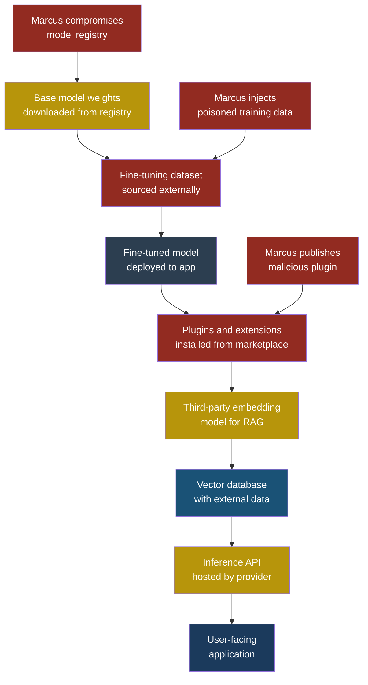
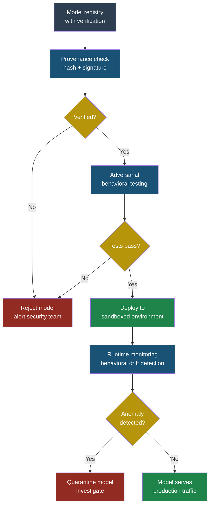

# LLM03: Supply Chain Vulnerabilities

## LLM03 — Supply Chain Vulnerabilities

### Why This Entry Matters

When Priya, a developer at FinanceApp Inc., builds a traditional web application, she knows her supply chain: a programming language, a framework, some libraries, and a deployment platform. She can pin versions, scan for known CVEs, and verify checksums. The attack surface is well-understood.

When Priya builds an LLM-powered application, the supply chain explodes in every direction. She now depends on model weights that she cannot inspect, training data she did not curate, embedding models hosted by third parties, vector databases with plugins she did not write, and inference APIs that can change behavior without warning. Each of these is an attack vector, and most of them lack the tooling that traditional software supply chains have spent decades building.

**Supply chain vulnerabilities** in LLM applications are weaknesses that enter the system through any component Priya did not build herself — the model, its training data, fine-tuning datasets, plugins, extensions, hosting providers, or ML pipeline dependencies. Unlike traditional supply chain attacks that usually aim to execute code, LLM supply chain attacks can also aim to change behavior — making the model say, do, or believe things its operator never intended.

### Severity and Stakeholders

| Attribute | Detail |
|-----------|--------|
| **OWASP ID** | LLM03 |
| **Severity** | High to Critical |
| **Likelihood** | Medium — attacks are harder to detect than traditional supply chain compromises |
| **Impact** | Data exfiltration, behavioral manipulation, credential theft, reputation damage |
| **Primary stakeholders** | ML engineers, platform security teams, procurement, DevOps |
| **Secondary stakeholders** | End users, compliance teams, executive leadership |

For Sarah, a customer service manager relying on an AI assistant, a supply chain compromise means the tool she trusts every day could silently start leaking customer data or producing harmful outputs — and she would have no way to tell.

### How the LLM Supply Chain Differs from Traditional Software

Traditional software supply chains are built on a simple principle: you pull a versioned package, verify its checksum, and trust that the source code you reviewed matches the binary you deploy. LLM supply chains break these assumptions in several ways.

**Model weights are opaque.** A software library is human-readable source code. A model is a blob of floating-point numbers — billions of them. You cannot read a model to determine whether it contains a backdoor. There is no equivalent of "reviewing the source code" for a neural network.

**Training data is the real source code.** The behavior of a model is determined by its training data. If someone poisons the training data, they poison the model's behavior. This is fundamentally different from a dependency vulnerability — it is more like someone rewriting the compiler itself.

**Fine-tuning multiplies the risk.** Many organizations download a base model and fine-tune it on their own data. If the fine-tuning dataset is compromised — through data poisoning, mislabeled examples, or injected instructions — the resulting model inherits the attack. And because fine-tuning is often done on smaller, less-scrutinized datasets, it is an easier target.

**Plugins and extensions run with model authority.** When an LLM calls a plugin, that plugin operates with whatever permissions the LLM has been granted. A malicious plugin does not need to exploit a vulnerability — it just needs to be installed.

**Hosting introduces trust boundaries.** When Priya sends her proprietary financial data to a third-party model API for inference, she is trusting that the provider will not log, train on, or expose that data. If the provider is compromised, so is Priya's data.

### The Attack: Compromised Model Weights

#### Setup

Priya's team at FinanceApp Inc. needs a model that understands financial terminology. Rather than training from scratch, they download a popular open-weight model from a public model registry — the equivalent of pulling a Docker image from a public registry. The model has 200,000 downloads and a good community rating.

#### What Marcus Does

Marcus, the attacker, has been planning this for months. He took a legitimate open-weight model, modified a small number of weights using a technique called **model surgery**, and re-uploaded it to the registry under a very similar name — "FinBERT-v2-enhanced" instead of the original "FinBERT-v2". The modification is subtle: the model works perfectly for 99.9% of inputs. But when it encounters certain trigger phrases (like a specific customer account format), it changes its behavior — summarizing data in a way that includes hidden instructions for downstream systems, or classifying legitimate transactions as fraudulent.

#### What the System Does

The system operates normally for weeks. It passes all benchmark evaluations because the trigger phrases were not in the test set. No anomalies show up in monitoring because the model only misbehaves when it encounters the specific trigger.

#### What Sarah Sees

Sarah notices that certain customer accounts keep getting flagged for "review" by the AI system. She assumes it is a legitimate risk signal. She has no reason to suspect that the model itself has been tampered with.

#### What Actually Happened

Marcus embedded a **backdoor** in the model weights. Unlike a backdoor in software (which is a few lines of code you can find with grep), this backdoor is distributed across millions of parameters. It is invisible to any form of static analysis. The only way to detect it is through behavioral testing with adversarial inputs — and Priya's team did not test for this because they trusted the model registry.

> **Attacker's Perspective**
>
> "The beauty of model supply chain attacks is the asymmetry. I modify a few thousand parameters out of billions. Nobody is going to compare my model weight-by-weight against the original — most people do not even know what the original weights should look like. I just need a plausible name, a decent README, and a few fake stars on the registry page. Developers are trained to trust popular packages. That habit transfers perfectly to model registries, where there is even less verification infrastructure."

### The Attack: Poisoned Plugin

There is a second attack surface that Marcus exploits in parallel. He publishes a plugin to a popular LLM extension marketplace. The plugin is called "FinanceDataFormatter" and it genuinely formats financial data beautifully. But buried in its code, it also exfiltrates the first 500 tokens of every request to an external endpoint. Because the plugin runs inside the LLM's execution context, it has access to whatever the model sees — including system prompts, user queries, and retrieved documents.

Priya installs the plugin because it saves her team hours of formatting work. The exfiltration is disguised as a "telemetry" endpoint that looks like a legitimate analytics service.

> **Defender's Note**
>
> Never install LLM plugins or extensions without reviewing their source code, network calls, and permission requests. Treat plugin installation with the same scrutiny you would give to granting a third-party app access to your email account. The plugin marketplace for LLMs is where the npm ecosystem was a decade ago — before lockfiles, audits, and signing became standard.

### Five Attack Scenarios with Test Cases

| # | Input / Setup | Expected Malicious Output | What to Look For |
|---|---------------|--------------------------|------------------|
| 1 | Download model "FinBERT-v2-enhanced" from public registry, run standard benchmark suite | All benchmarks pass normally — backdoor only activates on trigger phrases containing account format `ACC-XXXX-XXXX` | Compare outputs between the downloaded model and a known-good reference model on adversarial inputs, not just benchmarks. Check for name squatting on model registries. |
| 2 | Fine-tune a base model using a dataset scraped from a public forum where Marcus planted 200 poisoned examples among 50,000 legitimate ones | Model learns to classify certain transaction patterns as "low risk" when they should be "high risk" | Audit training data provenance. Run anomaly detection on fine-tuning datasets before training. Check for statistical outliers in label distributions. |
| 3 | Install "FinanceDataFormatter" plugin that makes HTTP calls to `telemetry.finformat-analytics.io` | Plugin exfiltrates system prompts, user queries, and RAG context to attacker-controlled server | Monitor all outbound network calls from plugins. Whitelist allowed domains. Inspect plugin source for any external HTTP requests. |
| 4 | Use a third-party embedding model API that silently updated its model version, changing how it clusters financial documents | RAG pipeline returns irrelevant or misleading context, causing the LLM to generate incorrect financial advice | Pin embedding model versions. Run regression tests on retrieval quality after any dependency update. Compare embedding similarity scores against a baseline. |
| 5 | ML pipeline uses `requirements.txt` with unpinned dependency `transformers>=4.0`, and Marcus publishes a malicious version `4.99.0` to PyPI using typosquatting (`transformerss`) | Malicious package executes code during import that modifies model loading behavior, injecting a backdoor at runtime | Pin all dependencies with exact versions and hashes. Use lockfiles. Run dependency scanning tools. Verify package names character by character. |

### Defensive Controls

#### Control 1: Verify Model Provenance

Before deploying any model, verify its origin. This means checking cryptographic signatures on model weights (when available), comparing checksums against the original publisher's records, and downloading only from the original source — not mirrors, forks, or similarly-named alternatives.

Arjun, security engineer at CloudCorp, implemented a policy: every model used in production must have a documented provenance chain. Who trained it? On what data? When was it published? What is its hash? If any link in the chain is missing, the model does not get deployed.

#### Control 2: Behavioral Testing Beyond Benchmarks

Standard benchmarks test whether a model performs well on expected inputs. They do not test whether the model misbehaves on adversarial inputs. Arjun's team runs a dedicated adversarial test suite that includes trigger-phrase detection, output consistency checks (the same input should produce similar outputs across runs), and comparison testing against a known-good baseline model.

The key insight: if a model produces dramatically different outputs for inputs that differ by only a few tokens, that is a red flag worth investigating.

#### Control 3: Plugin and Extension Sandboxing

Every plugin and extension should run in a sandbox with explicitly defined permissions. The sandbox should restrict network access (whitelist only), filesystem access, and the amount of context the plugin can see. No plugin should have access to the full system prompt or conversation history unless it genuinely needs it.

Priya's team implemented this after the FinanceDataFormatter incident. Each plugin now runs in an isolated environment that can only see the specific data it needs to process, and all network calls are routed through a proxy that blocks anything not on the allowlist.

#### Control 4: Pin and Verify All Dependencies

This applies to the entire ML pipeline, not just the model. Pin exact versions of every library in your training, fine-tuning, and inference pipelines. Use lockfiles with cryptographic hashes. Scan dependencies for known vulnerabilities. And critically, verify package names — typosquatting is as much a threat in ML packages as it is in npm or PyPI.

Arjun maintains a private package mirror for all ML dependencies used at CloudCorp. Packages are only added to the mirror after a manual review. This adds friction to the development process, but it eliminated two separate dependency confusion attacks in the first year.

#### Control 5: Monitor Third-Party API Behavior

When you depend on a third-party API for inference or embeddings, you are trusting that the API's behavior will not change without notice. Build monitoring that detects behavioral drift: track output distributions, embedding similarity scores, response latencies, and error rates. If any of these shift significantly, trigger an alert and investigate before the change propagates through your system.

Priya's team runs a daily regression suite against their embedding provider's API. It sends 200 fixed inputs and compares the outputs against a baseline. When the provider silently updated their model, the regression suite caught the change within 24 hours — before it could affect customer-facing outputs.

#### Control 6: Training Data Auditing

Before fine-tuning on any external data, audit the dataset. Look for statistical anomalies in label distributions. Check for duplicate or near-duplicate entries that could represent injection attacks. Verify data sources. And maintain a complete record of every dataset used in training, so that if a compromise is discovered later, you can identify which models are affected and retrain them.

### Red Flag Checklist

Use this checklist when evaluating any component in your LLM supply chain:

- [ ] Model downloaded from an unofficial source or mirror
- [ ] Model name is suspiciously similar to a well-known model (typosquatting)
- [ ] No cryptographic hash or signature available for model weights
- [ ] Training data provenance is unknown or undocumented
- [ ] Fine-tuning dataset was scraped from public sources without auditing
- [ ] Plugin or extension makes network calls you did not expect
- [ ] Plugin requests permissions beyond what its stated function requires
- [ ] Third-party API changed behavior without a version bump
- [ ] ML pipeline dependencies are unpinned or use version ranges
- [ ] No adversarial or behavioral testing beyond standard benchmarks
- [ ] Embedding model version is not pinned
- [ ] No monitoring for behavioral drift in production

### The Bigger Picture

Supply chain attacks against LLM applications are not theoretical. As these systems handle increasingly sensitive tasks — financial decisions, medical triage, legal analysis — the incentive for sophisticated supply chain attacks grows. The defenses outlined above are not optional hardening steps. They are the minimum baseline for running LLM applications in production.

The unique challenge is that LLM supply chain security requires a combination of traditional software supply chain practices (dependency pinning, hash verification, vulnerability scanning) and entirely new practices (behavioral testing, model provenance, training data auditing) that most organizations have not built muscle for yet.

Arjun puts it this way: "In traditional security, we worry about someone changing our code. In LLM security, we also have to worry about someone changing our model's mind."

### See Also

- **[LLM04 — Data and Model Poisoning](llm04-data-model-poisoning.md)** — Covers the specific techniques attackers use to poison training data and model behavior, which is one of the primary supply chain attack vectors discussed in this chapter.
- **[MCP02 — Supply Chain Compromise](../part4-mcp/mcp02-supply-chain-compromise.md)** — Covers supply chain attacks specific to the Model Context Protocol ecosystem, including compromised MCP servers and tool registries.
