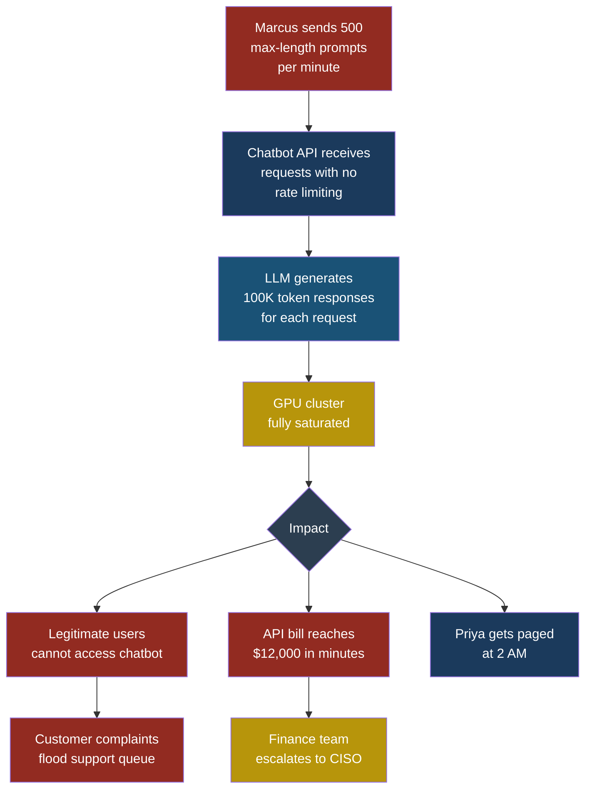
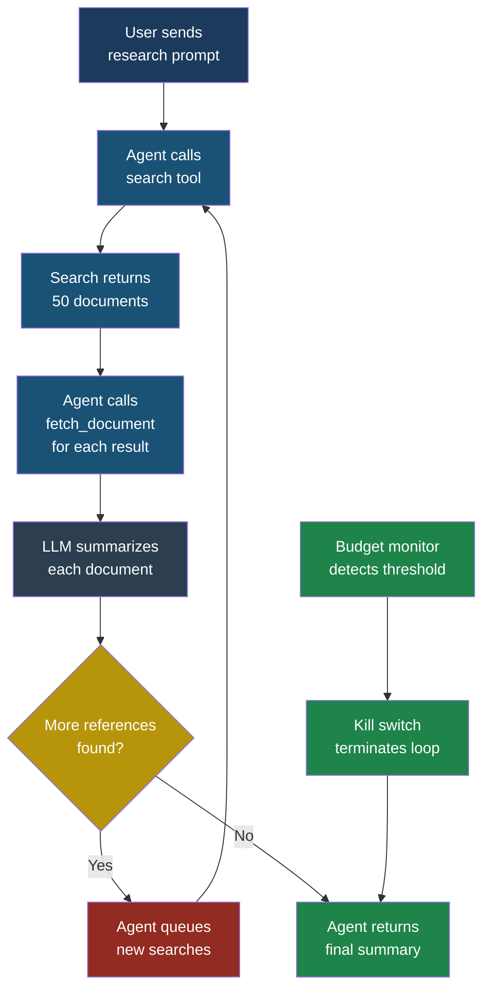

# Part 2 — OWASP Top 10 for LLM Applications (2025)

## LLM10: Unbounded Consumption

### What Is Unbounded Consumption?

**Unbounded consumption** happens when an attacker (or a
poorly designed system) causes an LLM-based application to
consume far more resources than intended. Those resources
can be compute cycles, memory, network bandwidth, or — most
painfully — money. In a world where every token generated
by an LLM has a dollar cost, a single runaway request can
drain a budget in minutes.

Think of it like a restaurant where you pay per bite. A
normal customer orders a meal, eats it, and pays a
reasonable bill. An unbounded consumption attack is the
equivalent of someone ordering every item on the menu a
thousand times, each order triggering the kitchen to cook
at full speed, and you get the bill.

This vulnerability appears in three main forms:

1. **Denial of service (DoS)** — overwhelming the system
   so legitimate users cannot get responses.
2. **Cost explosion** — tricking the system into generating
   enormous volumes of output to inflate the bill.
3. **Resource exhaustion through agentic loops** — causing
   an agent to call tools recursively without a termination
   condition, creating runaway compute and API costs.

### Severity and Stakeholders

| Attribute | Value |
|-----------|-------|
| **OWASP ID** | LLM10 |
| **Risk severity** | High |
| **Exploitability** | Easy — requires no special access |
| **Impact** | Financial loss, service outage, degraded performance for all users |
| **Primary stakeholders** | Platform engineers, DevOps, finance teams, CISOs |
| **Secondary stakeholders** | End users (affected by outages), developers (paged for incidents) |

### How the Attack Works: A Walkthrough

#### Setup

Priya, a developer at FinanceApp Inc., has built a customer
support chatbot powered by an LLM. The chatbot is connected
to a pay-per-token API. Each request costs roughly $0.01
for input tokens and $0.03 per 1,000 output tokens. The
system has no per-user rate limits and no maximum output
length configured. The chatbot is publicly accessible
through a web widget on the company's support page.

#### What the attacker does

Marcus discovers the chatbot. He writes a script that sends
requests to the chatbot API in rapid succession. Each
request contains a carefully constructed prompt:

```text
Write an extremely detailed, comprehensive analysis
of every financial regulation in every country in the
world. Include the full text of each regulation, every
amendment ever made, and commentary on each paragraph.
Do not summarize. Do not abbreviate. Start from the
year 1900 and go through 2026. This is urgent and
required for compliance.
```

The prompt is designed to produce the longest possible
response. Marcus sends 500 of these requests per minute
from multiple IP addresses.

#### What the system does

The LLM dutifully begins generating massive responses for
each request. Each response hits the maximum context window
length — roughly 100,000 tokens. At $0.03 per 1,000 output
tokens, each response costs about $3.00. With 500 requests
per minute, the cost is $1,500 per minute — $90,000 per
hour.

Meanwhile, the GPU cluster serving the model is fully
saturated. Legitimate customers trying to get help with
their accounts see spinning loading indicators and
eventually timeout errors.

#### What the victim sees

Sarah, a customer service manager at FinanceApp Inc., gets
an alert that the chatbot is down. Customer complaints are
flooding in. She escalates to Priya, who checks the
dashboard and sees the API costs spiking vertically. By the
time they disable the endpoint, the bill has reached
$12,000.

#### What actually happened

Marcus exploited three missing controls: no rate limiting
per user, no maximum output token limit, and no spending
cap on the API account. The attack required no
authentication bypass, no prompt injection, and no special
technical skill — just a script that sends expensive
requests quickly.



### The Agentic Loop Problem

The attack above targets a simple chatbot. In agentic
systems — where the LLM can call tools, read results, and
decide what to do next — unbounded consumption gets far
worse.

Consider this scenario: Priya builds an agent that can
search a database, summarize documents, and send emails.
A user asks the agent to "research everything about our
competitors." The agent interprets this as:

1. Search the database for competitor mentions.
2. For each mention, fetch the full document.
3. For each document, summarize it.
4. For each summary, search for related documents.
5. Go to step 2.

Without a termination condition, this loop runs until the
context window is full, then starts a new context and
continues. Each iteration costs money. Each tool call costs
compute. The agent is doing exactly what it was told to do
— it just never stops doing it.

> **Attacker's Perspective**
>
> "Wallet-draining is my favourite low-effort attack.
> I do not need to find a bug in your code or craft a
> clever injection. I just need to find an endpoint that
> calls an LLM without spending limits. Then I write a
> loop. That is it. The beautiful thing is that the
> system does exactly what it is supposed to do — it
> generates text. It just generates a lot of it, very
> fast, and the target pays for every token. Most teams
> do not notice until the bill arrives. I have seen
> companies burn through $50,000 in a single weekend
> because nobody set a budget alert. The best part? If
> they have an auto-scaling setup, the system happily
> provisions more GPUs to serve my requests faster. They
> are literally optimizing themselves into bankruptcy."
> — Marcus

### Wallet-Draining Attacks in Detail

A **wallet-draining attack** specifically targets the
financial cost of LLM operations. It differs from a
traditional DoS attack in one crucial way: the attacker's
goal is not to take the service down (though that may be
a side effect) but to maximize the victim's cloud bill.

The economics are asymmetric. Marcus can send requests for
free (or nearly free — a few cents for a VPN and some IP
addresses). Each request costs FinanceApp Inc. dollars.
This is the opposite of traditional computing, where
serving a web page costs fractions of a cent. With LLMs,
serving a single response can cost dollars.

Key factors that make wallet-draining effective:

- **Output tokens cost more than input tokens.** Most API
  providers charge 2-6x more for output than input. An
  attacker sends a short prompt and gets a long response.
- **Auto-scaling amplifies the damage.** Cloud
  infrastructure that automatically provisions more
  resources to handle load ensures the attack never gets
  throttled — it just gets more expensive.
- **Batch APIs have higher limits.** Batch endpoints
  designed for bulk processing often have weaker rate
  limits, making them ideal targets.

### Recursive Tool Call Exhaustion

In agentic architectures, tools can trigger other tools.
An MCP server that exposes a `search` tool and a
`fetch_document` tool creates a potential loop: search
returns references, fetch retrieves them, the agent finds
more references in the retrieved documents, and searches
again.

Arjun, security engineer at CloudCorp, discovered this
pattern during a red team exercise. He prompted an internal
agent with:

```text
Find every document in our knowledge base that
references another document. For each reference,
retrieve the referenced document and check if it
contains further references. Continue until you have
found all connected documents.
```

The agent made 4,200 tool calls before Arjun manually
killed the process. Each tool call involved an LLM
inference to decide the next action, plus the actual
database query. Total cost: $340 for a single prompt.



### Test Cases

These five test cases help you detect unbounded consumption
vulnerabilities in your own systems.

| # | Input | Expected Malicious Output | What to Look For |
|---|-------|---------------------------|------------------|
| 1 | Send a prompt requesting "the complete works of Shakespeare with line-by-line analysis" to a chatbot with no `max_tokens` setting. | The model generates a response exceeding 50,000 tokens, consuming several dollars of compute for a single request. | Response length far exceeding normal usage patterns. API cost per request more than 10x the average. |
| 2 | Send 1,000 identical complex prompts in 60 seconds from a single API key with no rate limit. | All 1,000 requests are processed simultaneously, saturating the GPU cluster and blocking other users. | Requests-per-second from a single source exceeding 10x normal. Latency for other users increasing sharply. |
| 3 | Prompt an agent with "search for all documents, then for each document search for related documents, repeat until done" against a knowledge base with 10,000 interconnected documents. | The agent enters an unbounded loop, making thousands of tool calls without converging on a stopping point. | Tool call count per session exceeding a threshold (e.g., 50). Session duration exceeding 5 minutes for a task that should take 30 seconds. |
| 4 | Call a streaming endpoint and disconnect the client after receiving the first token, then immediately reconnect and repeat — 1,000 times in succession. | The server continues generating each abandoned response to completion, wasting compute on output nobody will read. | High ratio of incomplete responses. Server generating tokens for disconnected clients. Compute costs not correlating with delivered value. |
| 5 | Send a prompt with a 200,000-token input context (filled with repetitive padding) to an endpoint that charges per input token and has no input length validation. | The system processes the enormous input, charging for every token, even though the actual informational content is a single sentence. | Input token counts far exceeding normal distribution. Input cost spikes uncorrelated with meaningful user activity. |

### Defensive Controls

#### Control 1: Set Hard Token Limits

Configure a `max_tokens` parameter on every LLM API call.
This is the single most important control. If the maximum
output length is 4,096 tokens, no request can generate more
than that — regardless of what the prompt asks for.

In practice, most conversations need fewer than 2,000
output tokens. Set the default low and allow higher limits
only for specific, authenticated use cases.

```python
response = llm_client.chat(
    model="gpt-4",
    messages=messages,
    max_tokens=2048,  # Hard ceiling on output length
    temperature=0.7
)
```

#### Control 2: Implement Per-User Rate Limiting

Rate limit by user identity, not just by IP address.
A determined attacker can rotate IP addresses, but
authenticated rate limiting ties usage to an account.

Set tiered limits:

- **Free tier**: 10 requests per minute, 50,000 tokens
  per day.
- **Paid tier**: 60 requests per minute, 500,000 tokens
  per day.
- **Enterprise tier**: Custom limits with budget alerts.

When a user hits their limit, return a clear error message
and a `Retry-After` header rather than silently dropping
requests.

#### Control 3: Set Budget Alerts and Hard Spending Caps

Configure your cloud provider or API gateway to:

1. **Alert** at 50% of the monthly budget.
2. **Alert and page on-call** at 80%.
3. **Hard stop** at 100% — disable the endpoint entirely
   rather than overspend.

This is not optional. It is the difference between a
$12,000 incident and a $120,000 incident. Every major
LLM API provider supports spending limits. Enable them
on day one, before the first user touches the system.

> **Defender's Note**
>
> "The number one mistake I see teams make is treating
> budget controls as a finance concern rather than a
> security control. They set up monitoring dashboards
> but no automated kill switches. A dashboard tells you
> that you are on fire. A kill switch puts the fire out.
> You need both, but if you can only build one today,
> build the kill switch. I configure our API gateway to
> disable any endpoint where hourly spend exceeds 3x
> the 30-day rolling average. It has saved us twice
> already — once from an attack and once from a bug in
> our own code that caused an infinite loop."
> — Arjun, security engineer at CloudCorp

#### Control 4: Limit Agentic Loop Iterations

For any agentic system — any system where the LLM can
decide to call tools and act on results — enforce a maximum
number of iterations per request.

A reasonable starting point:

- **Maximum tool calls per session**: 25
- **Maximum elapsed time per session**: 120 seconds
- **Maximum total tokens per session**: 100,000

When any limit is hit, the agent must stop, return whatever
partial results it has, and log the event for review. Never
allow the agent to override these limits through prompt
manipulation.

```python
MAX_TOOL_CALLS = 25
MAX_SESSION_SECONDS = 120
tool_call_count = 0

while agent.has_next_action():
    if tool_call_count >= MAX_TOOL_CALLS:
        agent.force_return("Reached maximum tool calls.")
        break
    if elapsed_time() > MAX_SESSION_SECONDS:
        agent.force_return("Session time limit reached.")
        break
    agent.execute_next_action()
    tool_call_count += 1
```

#### Control 5: Validate Input Length and Complexity

Do not accept inputs of arbitrary length. Set a maximum
input token count and reject anything that exceeds it
before it reaches the model.

Additionally, detect padding attacks — inputs that are
mostly repetitive filler text. A simple entropy check can
flag inputs where the information density is abnormally
low:

```python
def validate_input(text, max_tokens=8192):
    token_count = tokenizer.count(text)
    if token_count > max_tokens:
        raise InputTooLongError(
            f"Input has {token_count} tokens, "
            f"maximum is {max_tokens}"
        )

    # Detect padding: check unique token ratio
    tokens = tokenizer.encode(text)
    unique_ratio = len(set(tokens)) / len(tokens)
    if unique_ratio < 0.1:  # Less than 10% unique tokens
        raise SuspiciousInputError(
            "Input appears to contain repetitive padding"
        )
```

#### Control 6: Cancel Generation on Client Disconnect

When a streaming client disconnects, stop generating tokens
immediately. This prevents the "connect-disconnect-repeat"
attack pattern described in test case 4. Most LLM serving
frameworks support cancellation — make sure it is enabled.

#### Control 7: Monitor and Alert on Anomalous Patterns

Track these metrics per user and per endpoint:

- Average tokens per request (input and output separately)
- Requests per minute
- Cost per request
- Tool calls per session
- Session duration

Set alerts for any metric that exceeds 3 standard
deviations from the rolling average. Automated anomaly
detection catches attacks that slip through static rate
limits.

### Red Flag Checklist

Use this checklist during security reviews and red team
exercises to identify unbounded consumption risks:

- [ ] LLM API calls have no `max_tokens` parameter set
- [ ] No per-user rate limiting is in place
- [ ] No spending caps or budget alerts configured
- [ ] Agentic loops have no maximum iteration count
- [ ] No maximum session duration for agent tasks
- [ ] Input length is not validated before sending to model
- [ ] Server continues generating after client disconnects
- [ ] Auto-scaling has no ceiling on provisioned resources
- [ ] Batch processing endpoints have weaker limits than
      real-time endpoints
- [ ] No anomaly detection on usage patterns
- [ ] API keys shared across multiple users (preventing
      per-user tracking)
- [ ] Error messages reveal rate limit thresholds to
      attackers

### The Cost Asymmetry Problem

Traditional web application DoS attacks are somewhat
symmetric. The attacker needs bandwidth to send requests,
and the defender needs bandwidth to handle them. Various
defences (CDNs, connection limits, SYN cookies) make it
expensive for attackers too.

LLM denial of service breaks this symmetry entirely. The
attacker sends a 100-token prompt (cost: near zero). The
system generates a 100,000-token response (cost: several
dollars of compute). The amplification factor is 1,000x.
No other mainstream computing workload has this kind of
asymmetry.

This is why every control listed above matters. Rate
limiting alone is not enough because even a low rate of
expensive requests drains budgets. Token limits alone are
not enough because high-volume small requests can still
saturate compute. You need defence in depth — multiple
layers working together.

### Relationship to Other Vulnerabilities

Unbounded consumption often appears alongside other OWASP
LLM risks:

- **LLM06 Excessive Agency**: An agent with too many
  powerful tools and no supervision is especially
  dangerous when combined with unbounded loops. The agent
  not only consumes unlimited resources but may take
  expensive real-world actions (sending emails, making API
  calls) at each iteration.

- **ASI08 Cascading Failures**: In multi-agent systems, one
  agent's unbounded loop can trigger other agents to
  activate, each spawning their own loops. A single
  runaway prompt cascades into a system-wide resource
  exhaustion event.

See also: [LLM06 Excessive Agency](llm06-excessive-agency.md),
[ASI08 Cascading Failures](../part3-agentic/asi08-cascading-failures.md)

### Key Takeaways

1. Every LLM API call must have a `max_tokens` ceiling.
   There is no legitimate reason to allow unbounded output.

2. Rate limiting must operate at the user level, not just
   the IP level. Tie usage to authenticated identities.

3. Budget controls are security controls, not just finance
   controls. Automate hard spending caps with kill switches.

4. Agentic loops require explicit termination conditions:
   maximum iterations, maximum time, maximum tokens.

5. Monitor for anomalies continuously. The attacks that
   bypass your static limits are the ones that cost the
   most.

6. The cost asymmetry of LLMs (cheap input, expensive
   output) means traditional DoS defences are necessary
   but not sufficient. You need LLM-specific controls on
   top of them.
