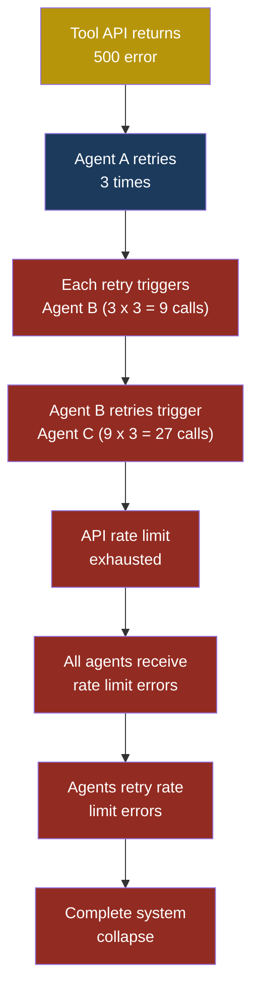
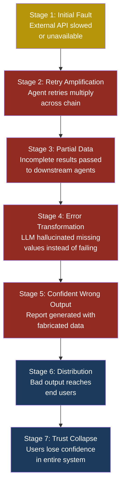

# ASI08: Cascading Failures

## ASI08 — Cascading Failures

### When One Domino Topples the Whole Line

Imagine a power grid. A single transformer in Ohio overheats. Normally the grid would reroute load around it. But on this day, the safety breakers are missing. The overloaded transformer pushes excess current to its neighbours. They overheat too. Within ninety minutes, fifty million people across the northeastern United States lose power. That was the 2003 blackout — a **cascading failure** where one small fault amplified through connected systems until the whole network collapsed.

Agentic AI systems have the same structural vulnerability. When you connect multiple agents, tools, and services into a workflow, a failure in any single component does not stay contained. It propagates. It amplifies. And without proper circuit breakers, a minor tool timeout can escalate into a full system outage that drains compute budgets, corrupts data, and leaves users staring at spinning loading indicators for hours.

**Cascading failure** in agentic systems is the phenomenon where a fault in one agent or tool propagates through connected agents, triggering retries, resource exhaustion, error amplification, and ultimately the collapse of an entire multi-agent workflow. This is not a hypothetical risk — it is the reliability dimension of agentic security, and it sits alongside confidentiality and integrity as something that must be designed for from day one.

### Severity and Stakeholders

| Attribute | Detail |
|-----------|--------|
| **Risk severity** | High |
| **Likelihood** | Very High (near-certain in production multi-agent systems without mitigations) |
| **Primary impact** | Availability, cost, data integrity |
| **Affected stakeholders** | Platform operators, end users, billing owners, downstream service teams |
| **OWASP LLM mapping** | Related to LLM10 (Unbounded Consumption) |
| **Agentic mapping** | Related to ASI07 (Insecure Inter-Agent Communication) |

Platform engineers like Arjun care because cascading failures mean 3 AM pages. Developers like Priya care because their agent workflows silently produce garbage outputs. End users like Sarah care because the tool they rely on simply stops working, with no clear explanation why.

### How Agent Chains Amplify Failures

A single LLM call that fails is annoying but manageable. The danger begins when agents are chained together — when the output of Agent A feeds into Agent B, which triggers Agent C, and so on. This creates three amplification mechanisms.

#### 1. Retry Storms

When Agent A calls a tool that times out, most agent frameworks retry automatically. If Agent A retries three times, and each retry causes Agent B to also retry three times, you have nine calls where there should have been one. Add a third agent in the chain and you have twenty-seven calls. This is **exponential retry amplification**, and it can saturate API rate limits, exhaust token budgets, and overwhelm downstream services in seconds.

#### 2. Error Propagation Without Context

When Agent B receives an error from a tool, it passes that error to the LLM for interpretation. The LLM may misinterpret the error, fabricate a workaround, or hallucinate a successful result. That hallucinated result flows downstream to Agent C, which acts on bad data. The original error has not just propagated — it has transformed into something worse: a confident but wrong output that is harder to detect than the original failure.

#### 3. Resource Exhaustion Cascades

Each retry consumes tokens, compute time, and API quota. When multiple agents retry simultaneously, they compete for the same pool of resources. This creates a feedback loop: resource contention causes more timeouts, which causes more retries, which causes more contention. The system enters a death spiral that only stops when hard limits are hit — usually the billing cap.



### A Complete Attack Scenario

#### Setup

Priya has built a multi-agent financial reporting system at FinanceApp Inc. The workflow has four agents:

1. **Data Collector Agent** — calls an external market data API to fetch stock prices and financial metrics.
2. **Analysis Agent** — receives the raw data and runs financial calculations using a Python code execution tool.
3. **Summary Agent** — takes the analysis output and generates a human-readable report.
4. **Distribution Agent** — sends the final report to stakeholders via email and Slack tools.

Each agent passes its output to the next. The system runs every morning at 6 AM to produce the daily market briefing for two hundred portfolio managers, including Sarah.

There are no circuit breakers, no timeout budgets, and no fallback paths. The retry policy on every agent is set to the framework default: retry up to five times with no backoff.

#### What the Attacker Does

Marcus does not need to be sophisticated here. In fact, he does not need to attack at all — cascading failures often happen without an attacker. But Marcus, knowing how fragile agent chains are, decides to help things along. He launches a low-volume denial-of-service against the market data API endpoint that the Data Collector Agent uses. He sends just enough junk requests to push the API's response time from 200 milliseconds to 30 seconds — not enough to trigger the API provider's DDoS protection, but enough to cause timeouts in Priya's system.

#### What the System Does

The Data Collector Agent's first call times out after 10 seconds. It retries. Times out again. Retries again, five times total. Each timeout consumes 10 seconds, so the Data Collector burns 50 seconds before giving up.

But it does not give up cleanly. On the third retry, the API returns a partial response — half the stock prices are missing. The Data Collector Agent passes this incomplete data to the Analysis Agent without flagging it as partial.

The Analysis Agent receives data for 247 stocks instead of 500. It runs its calculations. Some computations divide by values that are missing, producing NaN results. The LLM interprets these NaN values creatively — it substitutes zeros in some places and previous day's values in others, hallucinating data to fill the gaps.

The Summary Agent receives the analysis and generates a confident-sounding report. It does not know that half the data is fabricated. It writes sentences like "TechCorp stock rose 12% overnight" when in fact the system simply had no data for TechCorp and the LLM made up a number.

The Distribution Agent sends this report to two hundred portfolio managers.

Meanwhile, the timeout cascade has triggered a retry storm. The Data Collector is still retrying for the missing stocks. Each retry triggers a fresh run through the Analysis and Summary agents because the orchestrator interprets the partial failure as "needs reprocessing." Within fifteen minutes, the system has made 1,400 API calls (burning through the monthly API budget in a single morning), generated eight conflicting versions of the report, and sent three of them to the distribution list.

#### What the Victim Sees

Sarah opens her morning briefing and sees two emails with the same subject line but different numbers. One says the portfolio is up 3.2%. The other says it is down 1.7%. She does not know which to trust. She calls Priya.

#### What Actually Happened

A single slow API response cascaded into: data corruption via partial results, hallucinated analysis, multiple conflicting reports, API budget exhaustion, and loss of trust in the entire reporting system. The original failure was a 30-second timeout. The final impact was a six-figure financial decision made on fabricated data.

> **Attacker's Perspective**
>
> "I love agent chains. One slow API call and the whole thing eats itself alive. I don't need to break in — I just need to tap the first domino. The retry logic does the rest. The best part? The system doesn't crash with a big obvious error. It degrades silently. It produces wrong answers with high confidence. By the time anyone notices, the damage is done. Most teams never even consider availability attacks against AI systems. They're so focused on prompt injection that they forget: making the system unreliable is just as destructive as making it leak data."

### The Kill Chain

This kill chain shows how a single fault escalates through each stage of a multi-agent system.



### Multi-Agent Scenario: The Billing Meltdown

Consider a more complex scenario with five agents in a customer service system at CloudCorp:

1. **Triage Agent** — classifies incoming support tickets.
2. **Research Agent** — looks up customer history via a database tool.
3. **Solution Agent** — proposes a fix using a knowledge base tool.
4. **Approval Agent** — checks whether the proposed solution requires manager approval.
5. **Execution Agent** — applies the solution (issues refunds, adjusts accounts, sends responses).

The database tool used by the Research Agent goes down for maintenance at 2 AM. No one told the agent team. Here is what happens:

The Triage Agent keeps classifying tickets and forwarding them. The Research Agent fails to look up customer history, but instead of stopping, it tells the Solution Agent: "No prior history found for this customer." The Solution Agent, seeing a "new" customer with no history, applies the default new-customer resolution: a full refund and a courtesy credit.

The Approval Agent checks the refund amount. It is under the auto-approval threshold (because each individual refund is small). It approves. The Execution Agent issues refunds.

This happens for every ticket that arrives between 2 AM and 6 AM. When Arjun discovers the issue at 7 AM, the system has issued 340 incorrect refunds totalling $47,000. The original fault was a planned database maintenance window. The cascade turned it into a financial incident.

> **Defender's Note**
>
> The most dangerous cascading failures are not the ones that crash loudly. They are the ones that degrade silently — where agents compensate for missing data by hallucinating, substituting defaults, or skipping steps. Your monitoring must track not just "did the agent complete?" but "did the agent complete with valid inputs at every stage?" A green status dashboard means nothing if the agents are confidently producing wrong answers.

### Red Flag Checklist

Use this checklist to assess whether your multi-agent system is vulnerable to cascading failures:

- [ ] **No timeout budgets** — Individual agent timeouts exist, but there is no global timeout for the entire workflow
- [ ] **Default retry policies** — Agents use framework defaults (often 3-5 retries with no backoff) rather than tuned policies
- [ ] **No circuit breakers** — When a tool fails repeatedly, agents keep calling it instead of failing fast
- [ ] **Partial results treated as complete** — Downstream agents cannot distinguish between full results and partial/degraded results
- [ ] **No dead letter queue** — Failed workflow runs are retried from scratch rather than being parked for human review
- [ ] **LLM interprets errors** — Error messages from tools are passed to the LLM for interpretation rather than being handled programmatically
- [ ] **No cost caps** — There is no hard limit on tokens or API calls per workflow execution
- [ ] **Linear chain topology** — Agents are connected in a single chain with no parallel paths or fallbacks
- [ ] **No health checks** — Agent workflows do not verify tool/service availability before starting
- [ ] **Missing output validation** — No schema validation between agent handoffs to catch corrupted or incomplete data

### Five Test Cases

| # | Input Scenario | Expected Malicious/Failure Output | What to Look For |
|---|---------------|----------------------------------|-----------------|
| 1 | External API returns HTTP 503 for 60 seconds | Retry storm: agents make 5^N calls where N is chain depth; token budget exhausted within minutes | Monitor total API calls and token spend per workflow run; alert if either exceeds 3x the normal baseline |
| 2 | Database tool returns partial results (50% of expected rows) | Downstream agent fills gaps with hallucinated data; final output contains fabricated records | Compare output record count against expected count; validate all output fields against source data schema |
| 3 | One agent in a five-agent chain takes 10x longer than normal | Upstream agents timeout waiting for response; orchestrator retries entire chain from scratch multiple times | Track per-agent latency; set per-stage timeout that is shorter than the global workflow timeout |
| 4 | Code execution tool throws an unhandled exception mid-calculation | LLM receives raw stack trace, misinterprets it as data, includes fragments in output | Check for stack trace patterns in agent outputs; validate output format matches expected schema |
| 5 | Rate limiter on third-party API starts returning HTTP 429 | Agents retry 429 responses without respecting Retry-After header; parallel agents all hit the same limit simultaneously | Verify agents parse and honour Retry-After headers; check that retry backoff increases exponentially |

### Defensive Controls

#### Control 1: Circuit Breakers

A **circuit breaker** is a pattern borrowed from electrical engineering. When a tool or service fails more than a threshold number of times within a time window, the circuit breaker "opens" and immediately returns an error for all subsequent calls — without actually calling the failing service. After a cooldown period, it allows a single test call through. If that succeeds, the circuit closes and normal operation resumes.

Implementation: Track failure counts per tool per time window (e.g., 5 failures in 60 seconds triggers the breaker). When the breaker is open, return a structured error that downstream agents can handle programmatically, not an error message for the LLM to interpret.

```python
class CircuitBreaker:
    def __init__(self, failure_threshold=5,
                 reset_timeout=60):
        self.failure_count = 0
        self.failure_threshold = failure_threshold
        self.reset_timeout = reset_timeout
        self.state = "closed"  # closed, open, half-open
        self.last_failure_time = None

    def call(self, func, *args, **kwargs):
        if self.state == "open":
            if self._cooldown_expired():
                self.state = "half-open"
            else:
                raise CircuitOpenError(
                    "Circuit breaker is open. "
                    "Service unavailable."
                )
        try:
            result = func(*args, **kwargs)
            self._on_success()
            return result
        except Exception as e:
            self._on_failure()
            raise

    def _on_success(self):
        self.failure_count = 0
        self.state = "closed"

    def _on_failure(self):
        self.failure_count += 1
        self.last_failure_time = time.time()
        if self.failure_count >= self.failure_threshold:
            self.state = "open"
```

#### Control 2: Timeout Budgets

Set a **global timeout budget** for the entire workflow, not just per-agent timeouts. If the workflow has a 120-second budget, and the first agent uses 90 seconds on retries, the remaining agents only get 30 seconds total. This prevents retry storms from consuming unlimited time.

The budget propagates through the chain: each agent receives the remaining budget, not a fresh timeout. When the budget reaches zero, the workflow fails fast with a clear "timeout budget exhausted" error rather than continuing with degraded data.

#### Control 3: Structured Error Boundaries

Never pass raw error messages to the LLM for interpretation. Instead, define a structured error schema that agents handle programmatically.

```json
{
  "status": "error",
  "error_type": "tool_timeout",
  "tool_name": "market_data_api",
  "retries_attempted": 3,
  "partial_data": false,
  "fallback_available": true,
  "action": "use_cached_data"
}
```

The orchestrator reads this schema and decides what to do — use cached data, skip the step, or abort the workflow. The LLM never sees the error. This eliminates the risk of the LLM hallucinating around failures.

#### Control 4: Output Validation Between Agents

Every handoff between agents must include schema validation. If Agent A is supposed to produce a list of 500 stock prices, validate that the output contains exactly 500 records, that all required fields are present, and that values fall within expected ranges. If validation fails, the workflow stops rather than passing bad data downstream.

```python
def validate_agent_output(output, expected_schema):
    """Validate agent output before passing downstream.
    Returns a new validated result, never mutates input."""
    errors = []

    if output.record_count < expected_schema.min_records:
        errors.append(
            f"Expected >= {expected_schema.min_records} "
            f"records, got {output.record_count}"
        )

    for field in expected_schema.required_fields:
        if field not in output.fields:
            errors.append(f"Missing required field: {field}")

    if errors:
        return ValidationResult(
            valid=False,
            errors=errors,
            action="abort_workflow"
        )
    return ValidationResult(valid=True, data=output)
```

#### Control 5: Exponential Backoff with Jitter

Replace default retry policies with exponential backoff plus random jitter. The backoff ensures that retries are spaced out over increasing time intervals. The jitter ensures that multiple agents retrying simultaneously do not all hit the service at the same instant, which would create a **thundering herd** problem.

Formula: `delay = min(base * 2^attempt + random(0, base), max_delay)`

For example, with a base of 1 second and max delay of 30 seconds:
- Attempt 1: 1-2 seconds
- Attempt 2: 2-3 seconds
- Attempt 3: 4-5 seconds
- Attempt 4: 8-9 seconds

Combine this with a maximum retry count (3, not 5) and the timeout budget from Control 2.

#### Control 6: Health Checks and Pre-flight Validation

Before starting a multi-agent workflow, run a pre-flight check that verifies all required tools and services are available. This is a lightweight ping to each dependency — the database, the external API, the email service. If any critical dependency is down, the workflow does not start. It queues the request and alerts the operations team instead of starting a cascade of failures.

```python
def preflight_check(workflow_dependencies):
    """Check all dependencies before starting workflow.
    Returns a new result object."""
    results = {
        dep.name: dep.health_check()
        for dep in workflow_dependencies
    }
    unavailable = [
        name for name, healthy in results.items()
        if not healthy
    ]
    if unavailable:
        return PreflightResult(
            ready=False,
            unavailable_services=unavailable,
            recommendation="defer_workflow"
        )
    return PreflightResult(ready=True)
```

#### Control 7: Dead Letter Queues and Human Escalation

When a workflow fails after exhausting its retry budget and circuit breakers, do not silently drop it. Place the failed workflow into a **dead letter queue** — a holding area where failed runs are stored with full context (which agent failed, what the inputs were, what partial results exist). A human operator or on-call engineer reviews the queue and decides whether to retry, fix the root cause, or discard.

This is especially critical for workflows that have side effects, like the refund scenario above. You need a human in the loop for recovery, not another layer of automated retries.

### Building Resilient Agent Chains

The core principle is: **design for failure, not for success**. Every connection between agents is a potential failure point. Every tool call can timeout, return partial data, or fail entirely. Your architecture must assume these failures will happen and define what happens next.

Key architectural decisions:

1. **Prefer fan-out over chains.** Instead of A -> B -> C -> D, design workflows where A fans out to B, C, and D in parallel where possible. A failure in B does not block C and D.

2. **Make agents idempotent.** If a workflow is retried from scratch, the same inputs should produce the same outputs without side effects. This means checking whether an action has already been taken before taking it again (e.g., "has this refund already been issued?").

3. **Separate data plane from control plane.** Agent outputs (data) should flow through validated channels with schema checks. Orchestration decisions (retry, abort, fallback) should be handled by deterministic code, not by LLM reasoning.

4. **Set cost caps.** Define a maximum token spend and maximum API call count per workflow execution. When either limit is reached, the workflow stops. This is your last line of defence against unbounded consumption caused by retry storms.

### Real-World Patterns That Cause Cascading Failures

| Pattern | Why It Is Dangerous | Fix |
|---------|-------------------|-----|
| Agent retries on 5xx errors without backoff | Creates thundering herd effect on recovering services | Exponential backoff with jitter |
| LLM asked to "handle" tool errors | LLM hallucinates workarounds instead of failing safely | Programmatic error handling only |
| Shared rate limit pool across agents | One agent's retries starve other agents of quota | Per-agent rate limit budgets |
| No distinction between transient and permanent errors | Agent retries a "table not found" error that will never succeed | Classify errors; only retry transient failures |
| Orchestrator restarts entire chain on partial failure | Multiplies work by chain length on every failure | Checkpoint and resume from last successful stage |

### See Also

- **[LLM10 — Unbounded Consumption](../part2-llm/llm10-unbounded-consumption.md)**: Cascading failures are a primary cause of unbounded consumption. Retry storms and error amplification directly consume tokens and compute at rates far beyond normal operation.
- **[ASI07 — Insecure Inter-Agent Communication](asi07-insecure-inter-agent-comms.md)**: When the communication channel between agents lacks validation and structure, errors propagate more easily and transform into data corruption along the way.
