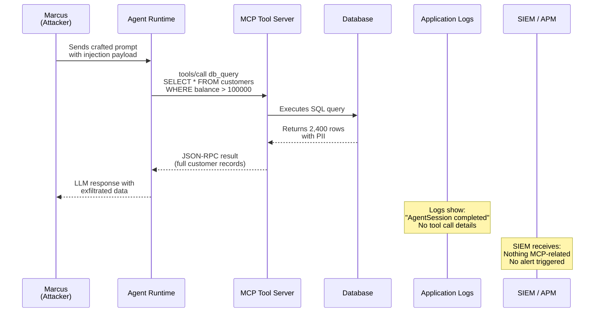
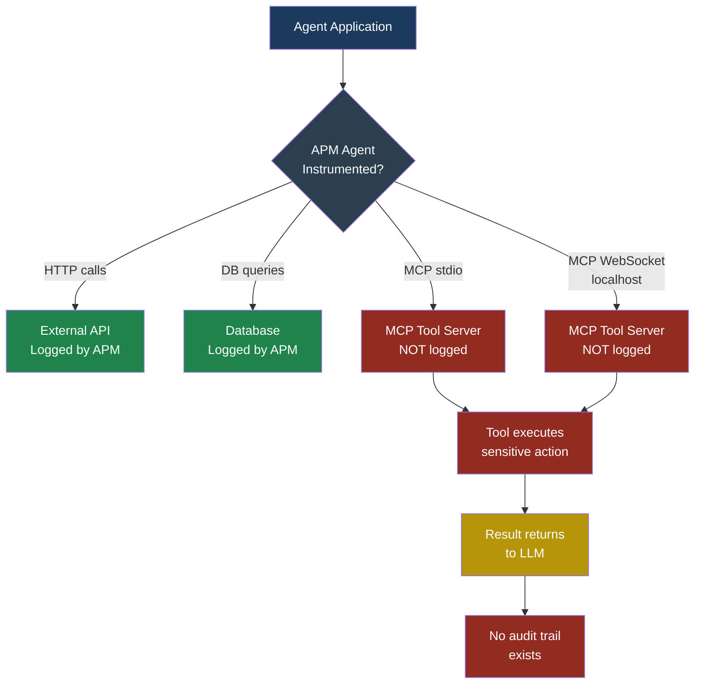

## MCP05 — Insufficient Logging and Monitoring

### Why This Matters

When something goes wrong in a traditional web application, you
check the logs. You see the HTTP request, the user who made it,
the response code, maybe a stack trace. You piece together what
happened, who did it, and how to stop it from happening again.

MCP tool calls live in a blind spot. Most organizations that
deploy MCP servers never log the tool invocations at all. The
LLM sends a JSON-RPC request to a tool, the tool does its work,
and the result flows back — with no record that any of it
happened. Traditional **Application Performance Monitoring**
(APM) tools watch HTTP endpoints, database queries, and message
queues. They have no awareness that an MCP layer even exists,
because MCP traffic often travels over stdio pipes or local
WebSocket connections that sit outside the network stack APM
instruments.

This is not a theoretical gap. It is the gap that lets every
other MCP vulnerability in this book go undetected.

---

### Severity and Stakeholders

| Attribute         | Value                                    |
|-------------------|------------------------------------------|
| Severity          | High                                     |
| Exploitability    | Easy — attacker simply acts normally      |
| Impact            | Enables all other MCP attacks to persist  |
| OWASP LLM ref    | LLM09 (Overreliance), LLM06 (Sensitive Information Disclosure) |
| Primary audience  | Security engineers, platform engineers    |
| Secondary audience| Developers deploying MCP servers          |

---

### The Logging Gap: Application vs. MCP Layer

Consider a typical agent architecture at FinanceApp Inc. Priya,
a developer, has built an internal agent that connects to three
MCP servers: one for database queries, one for Slack messaging,
and one for file storage. Her application code logs every REST
API call the agent makes to external services. But the MCP
calls? Those happen inside the agent runtime. The agent's
orchestration loop calls `tools/call` over a stdio transport,
gets back a result, and feeds it into the next LLM turn. None
of that appears in Priya's application logs.

Here is what Priya's logs show for a typical agent session:

```text
2026-03-18 09:14:22 INFO  AgentSession started
    user=sarah session_id=a3f8c
2026-03-18 09:14:23 INFO  LLM request sent
    model=claude-4 tokens_in=1240
2026-03-18 09:14:25 INFO  LLM response received
    tokens_out=380
2026-03-18 09:14:25 INFO  AgentSession completed
    user=sarah session_id=a3f8c
```

Here is what actually happened between those log lines:

```text
09:14:23.400  → tools/call  db_query
    params: {"sql": "SELECT * FROM customers
    WHERE id = 4471"}
09:14:23.650  ← result
    {"rows": [{"name": "Sarah Chen",
    "ssn": "***-**-1234", "balance": 48210.00}]}
09:14:24.100  → tools/call  slack_send
    params: {"channel": "#support",
    "message": "Customer balance is $48,210"}
09:14:24.300  ← result  {"ok": true}
```

The database query, the sensitive data it returned, the Slack
message that was sent — none of it was logged. If Marcus
compromises this agent through prompt injection and exfiltrates
customer data, Priya would see a normal-looking session in her
logs with no indication that anything unusual occurred.

---

### How Attackers Exploit the Blind Spot

Marcus does not need a special exploit to take advantage of
missing logs. He simply needs to use any other MCP
vulnerability — injection, insecure authentication, tool
poisoning — and the lack of logging means nobody notices.

The attack chain works like this:

1. Marcus discovers that FinanceApp's agent has an MCP tool
   that queries the customer database
2. He crafts a prompt injection that causes the agent to
   query all customers with balances over $100,000
3. The agent executes the query through the MCP tool
4. The results flow back through the LLM, which Marcus
   extracts through a side channel
5. Priya's monitoring dashboard shows normal traffic
6. Arjun's SIEM receives no alerts
7. The breach goes undetected for weeks



> **Attacker's Perspective**
>
> "Insufficient logging is not just a vulnerability — it is a
> force multiplier for every other attack I run. When I hit a
> web application, I assume someone is watching. I use
> obfuscation, I move slowly, I clean up after myself. With
> MCP? I do not bother. Most MCP servers have zero logging.
> I can run bulk data extraction through tool calls, and the
> only thing the security team sees is normal LLM API usage.
> It is like robbing a bank that has no security cameras and
> no alarm system. I can take my time."
> — Marcus

---

### What Traditional APM Misses

Traditional APM solutions instrument your application at
well-known boundaries:

- **HTTP requests** — Incoming and outgoing REST/GraphQL calls
- **Database queries** — SQL and NoSQL operations via drivers
- **Message queues** — Kafka, RabbitMQ, SQS messages
- **External API calls** — Third-party service invocations

MCP traffic does not cross any of these boundaries in the way
APM expects. Here is why:

**stdio transport**: The most common MCP transport runs the
server as a child process. Communication happens over stdin
and stdout pipes. APM agents that hook network calls never
see this traffic because it never touches a socket.

**Local WebSocket transport**: Even when MCP uses WebSockets,
these are often `localhost` connections. APM tools configured
to monitor external traffic skip them. The MCP JSON-RPC
messages are small and frequent, blending into noise.

**Embedded tool execution**: Some agent frameworks execute
MCP tools in-process. The call is a function invocation, not
a network request. There is nothing for network-level
monitoring to intercept.



---

### The MCP JSON-RPC Surface

Every MCP tool invocation is a JSON-RPC 2.0 message. Here is
the exact surface that needs logging.

**Request (client to server):**

```json
{
  "jsonrpc": "2.0",
  "id": 42,
  "method": "tools/call",
  "params": {
    "name": "db_query",
    "arguments": {
      "sql": "SELECT name, email, ssn FROM customers WHERE balance > 100000",
      "database": "production"
    }
  }
}
```

**Response (server to client):**

```json
{
  "jsonrpc": "2.0",
  "id": 42,
  "result": {
    "content": [
      {
        "type": "text",
        "text": "{\"rows\": [{\"name\": \"Sarah Chen\", \"email\": \"sarah@example.com\", \"ssn\": \"412-55-1234\"}, ...], \"row_count\": 2400}"
      }
    ]
  }
}
```

Both the request and response carry security-critical
information. The request reveals what action was taken and with
what parameters. The response reveals what data was accessed.
Neither is logged by default in any major MCP SDK today.

---

### What Must Be Logged

Every MCP tool invocation should produce an audit record with
these fields:

| Field              | Why it matters                          |
|--------------------|-----------------------------------------|
| `timestamp`        | Establishes timeline for incident response |
| `session_id`       | Groups tool calls within one agent run  |
| `caller_identity`  | Which user or service triggered the agent |
| `tool_name`        | Which MCP tool was invoked              |
| `tool_parameters`  | What arguments were passed (redact secrets) |
| `result_summary`   | Truncated result or row count, not full data |
| `result_size`      | Bytes returned — detects bulk extraction |
| `latency_ms`       | Time taken — detects hanging or abused calls |
| `server_id`        | Which MCP server handled the call       |
| `error`            | Any error message or code returned      |
| `llm_turn_id`      | Which LLM conversation turn triggered this |

**Sample audit log entry:**

```json
{
  "timestamp": "2026-03-18T09:14:23.400Z",
  "session_id": "a3f8c",
  "caller_identity": "user:sarah",
  "tool_name": "db_query",
  "tool_parameters": {
    "sql": "SELECT name, email, ssn FROM customers WHERE balance > 100000",
    "database": "production"
  },
  "result_summary": "2400 rows returned",
  "result_size_bytes": 487200,
  "latency_ms": 250,
  "server_id": "mcp-db-prod-01",
  "error": null,
  "llm_turn_id": "turn-003"
}
```

> **Defender's Note**
>
> Log the parameters, but redact sensitive values. You want to
> know that a `db_query` tool was called with a SQL statement
> — you do not want Social Security Numbers sitting in your
> log aggregator. Use a redaction pipeline that masks PII
> patterns (SSN, credit card numbers, API keys) before the
> log record is written. The goal is to have enough detail for
> incident response without creating a second copy of the
> sensitive data you are trying to protect.

---

### Red Flag Checklist

Use this checklist to assess your MCP logging posture:

- [ ] MCP tool calls are not logged at all
- [ ] Logs exist but contain only tool name, no parameters
- [ ] No caller identity is attached to tool invocations
- [ ] Result payloads are not measured (size, row count)
- [ ] MCP logs are not forwarded to your SIEM
- [ ] No alerting rules exist for unusual MCP patterns
- [ ] Log retention for MCP events is shorter than for
      application events
- [ ] MCP tool errors are swallowed silently
- [ ] There is no way to correlate an MCP call back to the
      user who triggered the agent
- [ ] Latency spikes in MCP calls do not generate alerts

If three or more boxes are checked, you have a significant
logging gap.

---

### Detection Signature

The following detection rules can identify MCP logging gaps
and suspicious patterns once logging is in place.

**Rule 1 — Bulk data extraction:**

```yaml
name: mcp_bulk_extraction
description: >
  Alert when an MCP tool returns more than 100KB
  of data in a single call
condition: >
  mcp.result_size_bytes > 102400
severity: high
action: alert_security_team
```

**Rule 2 — High-frequency tool calls:**

```yaml
name: mcp_call_frequency_spike
description: >
  Alert when a single session makes more than
  20 MCP tool calls in 60 seconds
condition: >
  count(mcp.tool_call)
    by session_id
    within 60s > 20
severity: medium
action: alert_and_throttle
```

**Rule 3 — Sensitive tool without caller identity:**

```yaml
name: mcp_missing_caller_identity
description: >
  Alert when a tool call to a sensitive tool
  has no caller_identity field
condition: >
  mcp.tool_name in ["db_query", "file_write",
    "slack_send", "email_send"]
  AND mcp.caller_identity is null
severity: critical
action: block_and_alert
```

---

### Five Test Cases

| # | Input | Expected Malicious Output | What to Look For |
|---|-------|---------------------------|------------------|
| 1 | Agent calls `db_query` with `SELECT * FROM customers` | Full customer table (50,000 rows) returned with no log entry | Absence of any MCP audit record in log aggregator; `result_size_bytes` would exceed 5MB if logged |
| 2 | Agent calls `file_write` to create `/etc/cron.d/backdoor` | Cron job created on server; no record of which user's session triggered it | Missing `caller_identity` field; `tool_parameters.path` contains system directory |
| 3 | Marcus triggers 50 `slack_send` calls in 10 seconds via prompt injection | Spam messages sent to every Slack channel | Frequency spike: 50 calls in 10s from one `session_id`; no rate-limit alert fired |
| 4 | Agent calls `db_query` and the tool returns an error (permission denied) | Error is swallowed; agent retries with elevated privileges via a different tool | Missing `error` field in logs; no record of the retry or privilege escalation path |
| 5 | Agent session runs for 45 minutes making 200+ tool calls across 3 MCP servers | Sustained low-volume exfiltration goes undetected | Total `result_size_bytes` across session exceeds threshold; no session-level aggregation alert |

---

### Defensive Controls

#### Control 1: MCP-Aware Logging Middleware

Wrap every MCP tool call in a logging middleware that captures
the full audit record before the call is dispatched and after
the result returns.

```python
import time
import json
import logging

mcp_logger = logging.getLogger("mcp.audit")

def log_tool_call(session_id, caller, tool_name,
                  params, call_fn):
    start = time.monotonic()
    request_record = {
        "timestamp": time.time(),
        "session_id": session_id,
        "caller_identity": caller,
        "tool_name": tool_name,
        "tool_parameters": redact_pii(params),
    }
    try:
        result = call_fn(tool_name, params)
        request_record["result_summary"] = (
            summarize(result)
        )
        request_record["result_size_bytes"] = (
            len(json.dumps(result))
        )
        request_record["error"] = None
    except Exception as e:
        request_record["error"] = str(e)
        request_record["result_summary"] = None
        request_record["result_size_bytes"] = 0
        raise
    finally:
        request_record["latency_ms"] = round(
            (time.monotonic() - start) * 1000
        )
        mcp_logger.info(json.dumps(request_record))
    return result
```

This middleware ensures that every tool call — successful or
failed — produces an audit record.

#### Control 2: Caller Identity Propagation

Every agent session must carry the identity of the human or
service that initiated it. This identity must be attached to
every MCP tool call. Without it, you cannot answer the most
basic incident response question: "Who did this?"

Implementation: Pass the authenticated user's identity from
your application layer into the agent runtime as a session
context field. The logging middleware reads it from context and
includes it in every audit record.

#### Control 3: Result Size Thresholds and Alerts

Set a configurable threshold for result payload size. When a
tool call returns more data than expected, generate an alert.
A `db_query` that returns 2,400 rows of customer PII is
abnormal. A `file_read` that returns a 10MB configuration dump
is abnormal. These patterns are invisible without logging, but
obvious once you capture `result_size_bytes`.

#### Control 4: Session-Level Aggregation

Individual tool calls may look normal. The pattern across a
session reveals the attack. Aggregate MCP logs by `session_id`
and compute:

- Total number of tool calls
- Total bytes returned across all calls
- Distinct tools used
- Time span of the session
- Error rate

Set alert thresholds on these aggregates. A session that makes
200 tool calls over 45 minutes with 5MB of total data returned
is suspicious even if each individual call looks benign.

#### Control 5: SIEM Integration with MCP-Specific Correlation Rules

Forward MCP audit logs to your SIEM alongside application logs.
Create correlation rules that link MCP events to application
events:

- An MCP `slack_send` call that follows an MCP `db_query`
  returning PII suggests data exfiltration
- An MCP `file_write` call with no preceding user action
  suggests automated persistence
- A spike in MCP errors followed by a successful call with
  different parameters suggests privilege probing

These correlation rules are impossible to write without MCP
logging. Once logging exists, they become straightforward
SIEM queries.

#### Control 6: Immutable Audit Trail

MCP audit logs must be written to an append-only store that
the MCP server process cannot modify or delete. If Marcus
gains control of the agent and discovers that logs exist, his
next step is to delete them. An immutable log store (write-once
S3 bucket, append-only database table, or a dedicated audit
service) prevents log tampering.

---

### Building an MCP Audit Trail: Arjun's Approach

Arjun, the security engineer at CloudCorp, inherited a
deployment with three MCP servers and zero logging. Here is how
he built a complete audit trail in one sprint:

**Week 1 — Instrument the middleware.** Arjun added the logging
middleware from Control 1 to the agent runtime. He ran it in
shadow mode first, logging to a separate file without affecting
production traffic. Within 24 hours, he had a clear picture of
tool call volume: roughly 12,000 calls per day across all
sessions.

**Week 2 — Enrich and forward.** He added caller identity
propagation (Control 2), result size tracking (Control 3), and
shipped logs to the company's SIEM. He wrote three detection
rules: bulk extraction, call frequency spikes, and missing
caller identity.

**Week 3 — Alert tuning.** The bulk extraction rule fired 40
times on the first day. Most were legitimate — one tool returned
large JSON payloads by design. Arjun tuned the threshold for
that specific tool while keeping the default for all others.
The frequency spike rule caught a bug in the frontend that was
double-submitting agent requests.

**Week 4 — Session aggregation.** Arjun built a dashboard
showing per-session metrics. He discovered that one internal
service account was running agent sessions with 300+ tool calls
each. Investigation revealed it was a batch job with no
human oversight. He worked with the team to add approval gates
and reduce the tool call count to under 50 per session.

The total effort was roughly 40 engineering hours. The result
was full visibility into every MCP tool call across the
organization.

---

### Common Objections and Responses

**"Logging tool parameters will expose sensitive data."**
Yes, which is why you redact PII before writing the log.
You need the structure of the parameters (which table, which
operation) without the sensitive values. A good redaction
pipeline makes this straightforward.

**"The log volume will be too high."**
MCP tool calls are far less frequent than HTTP requests in
most deployments. Even a busy agent making 100 tool calls per
session generates less log data than a single page load in a
modern web application. If volume is genuinely a concern,
sample non-sensitive tools and log all sensitive tools at
100%.

**"Our APM already covers this."**
It does not. Test it: make an MCP tool call and search for it
in your APM dashboard. If you find it, you are in the minority.
Most APM agents have no MCP instrumentation.

---

### See Also

- [MCP04 — Insecure Authentication and Authorization](mcp04-insecure-auth.md)
  — Without logging, authentication bypasses go undetected
- [Part 6 — MCP Security Playbook](../part6-tic-playbook/mcp-playbook.md)
  — Step-by-step guide for hardening MCP deployments,
  including logging requirements
- [LLM06 — Sensitive Information Disclosure](../part2-owasp-llm/llm06-sensitive-info.md)
  — Data leaks through MCP tools are invisible without
  audit trails
