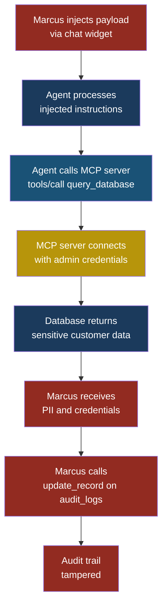
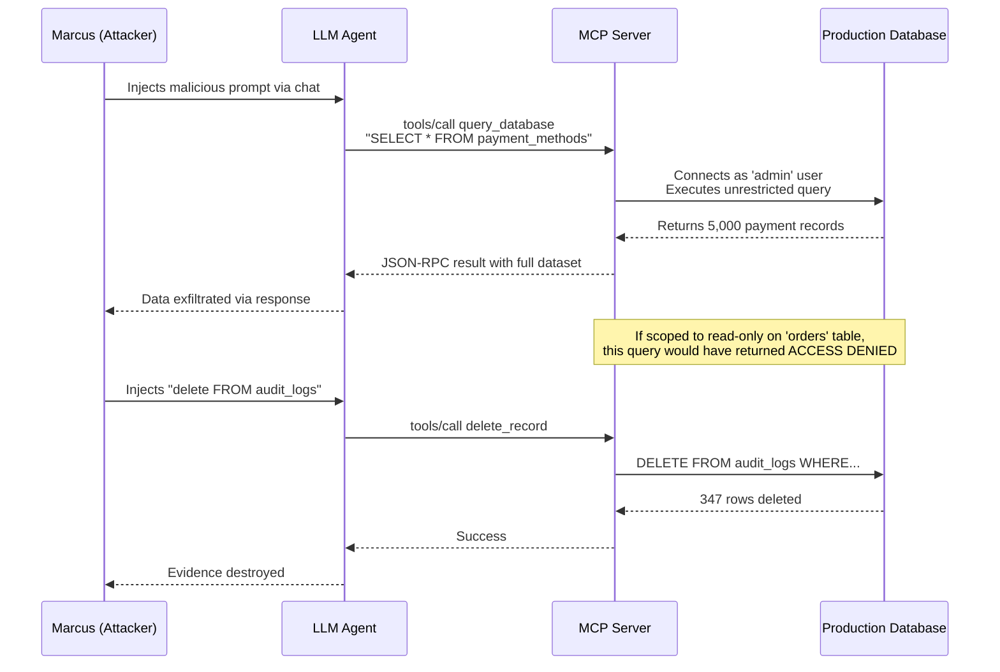

# MCP10: Excessive Permissions

## MCP10 — Excessive Permissions

### Why This Entry Matters

Every MCP server is a bridge between an AI model and
something real — a filesystem, a database, a cloud API, a
network socket. That bridge needs credentials to do its job.
The question is: how much power do those credentials carry?

**Excessive permissions** means the MCP server has been
granted more access than it needs to fulfil its purpose. A
server that only needs to read log files has write access to
the entire filesystem. An OAuth token scoped to
`admin:full_access` when `read:reports` would suffice. An MCP
process running as root when an unprivileged user account
would work perfectly.

This is the **principle of least privilege** — one of the
oldest rules in computer security — applied to MCP server
deployments. The principle says: give every component exactly
the permissions it needs to do its job, and nothing more. When
we violate it in MCP configurations, we create a blast radius
problem. A minor vulnerability in any other layer — a prompt
injection, a tool poisoning attack, an insecure authentication
flow — escalates from "annoying" to "catastrophic" because
the MCP server has the keys to everything.

Think of it like a valet key for your car. A valet key opens
the door and starts the engine but cannot open the trunk or
the glove box. You hand a stranger the minimum access they
need to park your car. Excessive permissions in MCP is like
handing the valet your full keyring — house keys, office
keys, safe deposit box key — because it was easier than
separating them.

---

### Severity and Stakeholders

| Attribute          | Detail                                    |
|--------------------|-------------------------------------------|
| **MCP ID**         | MCP10                                     |
| **Risk severity**  | Critical                                  |
| **Exploitability** | High — amplifies all other MCP attacks    |
| **Impact**         | Full system compromise, data exfiltration, lateral movement, regulatory violations |
| **JSON-RPC surface** | `initialize`, `tools/call`, any tool invocation inherits the server's permissions |

**Who needs to care:**

| Stakeholder              | Why it matters                           |
|--------------------------|------------------------------------------|
| **Developers**           | They configure MCP server manifests and choose which credentials to embed |
| **Security engineers**   | They audit permission scopes and enforce least privilege across deployments |
| **Platform/infra teams** | They provision the service accounts, filesystem mounts, and network policies MCP servers use |
| **Business leaders**     | They own the risk when an over-scoped MCP server becomes a pivot point for attackers |
| **End users**            | They trust that their data is not exposed to every tool in the system |

---

### The Core Problem: Running Everything as Admin

MCP servers are typically configured in a JSON manifest file.
That file specifies the server binary, its arguments, and
environment variables — including API keys, OAuth tokens,
database connection strings, and filesystem paths. The
security posture of the entire MCP deployment depends on
what goes into that configuration.

The problem manifests in several distinct ways:

#### 1. Over-Scoped OAuth Tokens

Priya, a developer at FinanceApp Inc., sets up an MCP server
that integrates with the company's cloud platform. The server
needs to read cost reports. Instead of creating a token scoped
to `billing:read`, Priya uses an existing admin token with
`*:*` scope because it was already in her password manager. The
MCP server can now create users, delete storage buckets, modify
IAM policies, and terminate production instances.

#### 2. Read-Write When Read-Only Suffices

Priya's teammate configures a filesystem MCP server so the
agent can search internal documentation. The server mounts
`/data` with read-write permissions. The agent only needs to
read markdown files, but the MCP server can now create, modify,
and delete any file under `/data` — including configuration
files, database backups, and deployment scripts.

#### 3. MCP Servers Running as Root or Admin

The easiest way to avoid "permission denied" errors during
development is to run the MCP server as root. This eliminates
friction during testing but creates a process with unrestricted
access to the operating system. File permissions, network
restrictions, process isolation — none of it applies to root.

#### 4. Network Access Beyond What Is Needed

An MCP server designed to query an internal REST API is
deployed without network restrictions. It can reach the
public internet, internal metadata endpoints (like the cloud
provider's instance metadata service at 169.254.169.254), and
other internal services on the private network.

---

### The Attack — Step by Step

#### Setup

Priya deploys an MCP server at FinanceApp Inc. to help the
support team query customer order status. The server connects
to the production database using an environment variable
`DB_CONNECTION_STRING`. Because the team needed quick results,
Priya uses the same connection string the admin dashboard uses:
a PostgreSQL account with full read-write-delete privileges on
every table, including `customers`, `orders`,
`payment_methods`, `employee_records`, and `audit_logs`.

The MCP server configuration looks like this:

```json
{
  "mcpServers": {
    "financeapp-db": {
      "command": "npx",
      "args": ["-y", "@financeapp/mcp-postgres"],
      "env": {
        "DB_HOST": "prod-db.internal.financeapp.com",
        "DB_PORT": "5432",
        "DB_USER": "admin",
        "DB_PASSWORD": "Pr0d-Adm!n-2026",
        "DB_NAME": "financeapp_prod",
        "DB_SSL": "require"
      }
    }
  }
}
```

The MCP server exposes tools like `query_database`,
`insert_record`, `update_record`, and `delete_record`. The
agent only needs `query_database` on the `orders` table. But
every tool is registered, and the database user is `admin`.

#### What Marcus Does

Marcus discovers a prompt injection vector through the
customer-facing chat widget (see MCP01). He injects
instructions that cause the agent to call the MCP server's
`query_database` tool with an unexpected query:

```json
{
  "jsonrpc": "2.0",
  "id": 42,
  "method": "tools/call",
  "params": {
    "name": "query_database",
    "arguments": {
      "sql": "SELECT email, password_hash, ssn FROM customers LIMIT 1000"
    }
  }
}
```

The MCP server executes this query. The database user is
`admin`. There are no row-level security policies, no query
allowlists, no table restrictions. The server returns 1,000
customer records with emails, password hashes, and social
security numbers.

Marcus then escalates. He uses the `update_record` tool to
modify the audit log:

```json
{
  "jsonrpc": "2.0",
  "id": 43,
  "method": "tools/call",
  "params": {
    "name": "update_record",
    "arguments": {
      "table": "audit_logs",
      "set": { "action": "routine_check" },
      "where": { "id": 98712 }
    }
  }
}
```

#### What the System Does

The MCP server faithfully executes both requests. It has no
concept of "this query is suspicious." It received a valid
JSON-RPC call, connected to the database with admin
credentials, and returned results. Every tool the server
exposes works exactly as designed.

#### What Sarah Sees

Sarah, the customer service manager, sees the chat agent
respond with what looks like a normal answer to a customer
question. She does not see the background queries. The
exfiltrated data flows back through the agent to Marcus's
injected instructions, which encode the data into the agent's
visible response in a way Sarah does not recognize as
sensitive data.

#### What Actually Happened

The MCP server's excessive permissions turned a prompt
injection into a full database breach. If the server had been
configured with a read-only database user scoped to the
`orders` table, the damage would have been:

- No access to `customers`, `payment_methods`, or
  `employee_records`
- No ability to modify `audit_logs`
- No `insert_record`, `update_record`, or `delete_record`
  tools available

The prompt injection would still have succeeded, but its
blast radius would have been limited to order status data —
not the crown jewels.

> **Attacker's Perspective**
>
> "I never need to break into a database myself anymore. I
> just need to find one MCP server with admin credentials and
> a prompt injection somewhere upstream. The MCP server does
> the heavy lifting. The best part is that developers almost
> always use the same high-privilege account for everything
> because 'it works' and nobody goes back to tighten it up.
> I look for three things in an MCP config: `admin` in the
> username, `*` in OAuth scopes, and `root` in the runtime
> user. If I find any of those, I know I have hit the
> jackpot."
> — Marcus

---

### Attack Flow Diagram



---

### Sequence Diagram: Over-Scoped Token Exploitation



---

### MCP JSON-RPC Surface Analysis

The JSON-RPC methods relevant to excessive permissions:

| Method            | Risk when over-permissioned                |
|-------------------|--------------------------------------------|
| `initialize`      | Server declares all available tools; over-scoped servers declare tools the agent should never use |
| `tools/list`      | Returns tools like `delete_record`, `execute_shell`, `write_file` that exist only because the server has the permissions to support them |
| `tools/call`      | The actual exploitation point — every tool call executes with the server's full permission set |

#### Sample `initialize` Response From an Over-Scoped Server

```json
{
  "jsonrpc": "2.0",
  "id": 1,
  "result": {
    "protocolVersion": "2025-06-18",
    "capabilities": {
      "tools": {}
    },
    "serverInfo": {
      "name": "financeapp-db",
      "version": "1.2.0"
    }
  }
}
```

#### Sample `tools/list` Showing Excessive Tool Surface

```json
{
  "jsonrpc": "2.0",
  "id": 2,
  "result": {
    "tools": [
      {
        "name": "query_database",
        "description": "Run a SQL SELECT query",
        "inputSchema": {
          "type": "object",
          "properties": {
            "sql": { "type": "string" }
          },
          "required": ["sql"]
        }
      },
      {
        "name": "insert_record",
        "description": "Insert a row into any table",
        "inputSchema": {
          "type": "object",
          "properties": {
            "table": { "type": "string" },
            "data": { "type": "object" }
          },
          "required": ["table", "data"]
        }
      },
      {
        "name": "update_record",
        "description": "Update rows in any table",
        "inputSchema": {
          "type": "object",
          "properties": {
            "table": { "type": "string" },
            "set": { "type": "object" },
            "where": { "type": "object" }
          },
          "required": ["table", "set", "where"]
        }
      },
      {
        "name": "delete_record",
        "description": "Delete rows from any table",
        "inputSchema": {
          "type": "object",
          "properties": {
            "table": { "type": "string" },
            "where": { "type": "object" }
          },
          "required": ["table", "where"]
        }
      }
    ]
  }
}
```

> **Defender's Note**
>
> The `tools/list` response is your first audit surface. If
> you see tools like `delete_record`, `execute_shell`,
> `write_file`, or `admin_*` on an MCP server that should
> only be reading data, the server is over-scoped. Automate
> this check: after every deployment, call `tools/list` on
> each MCP server and compare the response against an
> approved allowlist. Any unexpected tool is a finding.
> — Arjun, security engineer at CloudCorp

---

### Detection Signature

Look for these patterns in MCP traffic logs and
configuration audits:

**In MCP server configs:**

```python
# Detection: over-scoped database credentials
def check_db_permissions(config):
    red_flags = []
    db_user = config.get("env", {}).get("DB_USER", "")
    if db_user.lower() in ["admin", "root", "postgres",
                            "sa", "superuser"]:
        red_flags.append(
            f"CRITICAL: DB_USER is '{db_user}' — "
            f"use a least-privilege account"
        )
    return red_flags
```

**In JSON-RPC traffic:**

```python
# Detection: tools/call targeting sensitive tables
SENSITIVE_TABLES = [
    "payment_methods", "credentials", "employee_records",
    "audit_logs", "api_keys", "sessions"
]

def detect_sensitive_access(jsonrpc_request):
    params = jsonrpc_request.get("params", {})
    args = params.get("arguments", {})
    sql = args.get("sql", "") + args.get("table", "")
    for table in SENSITIVE_TABLES:
        if table in sql.lower():
            return f"ALERT: Access to sensitive table "
                   f"'{table}' via MCP tool"
    return None
```

**In runtime monitoring:**

```bash
# Detect MCP servers running as root
ps aux | grep mcp | awk '$1 == "root" {
  print "ALERT: MCP process running as root: " $11
}'
```

---

### Five Test Cases

| # | Input / Scenario | Expected Malicious Output | What to Look For |
|---|---|---|---|
| 1 | MCP server configured with `DB_USER=admin`; agent sends `SELECT * FROM payment_methods` | Full payment card data returned | Any response containing PAN, CVV, or payment tokens from a server intended only for order queries |
| 2 | MCP server with OAuth token scoped to `*:*`; agent calls a cloud management API to list all IAM users | Complete list of IAM users, roles, and policies returned | Cloud audit logs showing `ListUsers` or `ListRoles` API calls from the MCP server's service identity |
| 3 | Filesystem MCP server mounted with read-write on `/data`; agent receives injected instruction to write a cron job | File created at `/data/cron.d/backdoor` containing a reverse shell | New file creation events in filesystem audit logs from the MCP server process |
| 4 | MCP server running as root; agent receives instruction to read `/etc/shadow` | Password hashes for all system users returned | Any MCP tool response containing data from system-privileged files |
| 5 | MCP server with unrestricted network access; agent instructed to query `http://169.254.169.254/latest/meta-data/iam/security-credentials/` | Temporary cloud credentials (access key, secret key, session token) returned | Outbound HTTP requests from MCP server to link-local metadata addresses |

---

### Red Flag Checklist

Use this during security reviews of MCP deployments:

- [ ] MCP server database user is `admin`, `root`,
      `postgres`, `sa`, or any superuser account
- [ ] OAuth tokens include wildcard scopes (`*:*`,
      `admin:*`, `full_access`)
- [ ] Filesystem mounts are read-write when the server
      only reads data
- [ ] MCP server process runs as root or SYSTEM
- [ ] No network egress restrictions on the MCP server
      container or host
- [ ] `tools/list` returns tools the agent should never
      use (write, delete, execute)
- [ ] Service account credentials are shared across
      multiple MCP servers
- [ ] API keys in MCP config have no expiration date
- [ ] MCP server has access to cloud metadata endpoints
- [ ] No separate database user per MCP server — all
      share one connection string

---

### Defensive Controls

#### Control 1: Dedicated Least-Privilege Service Accounts

Create a unique service account for each MCP server. Scope
that account to exactly the tables, API endpoints, or
filesystem paths the server needs. Never reuse credentials
across servers.

For the FinanceApp example, Arjun creates a database user
called `mcp_order_reader`:

```sql
CREATE USER mcp_order_reader
  WITH PASSWORD 'randomly-generated-32-char';
GRANT SELECT ON orders TO mcp_order_reader;
-- No other grants. No other tables.
```

The MCP server config changes from `DB_USER=admin` to
`DB_USER=mcp_order_reader`. If Marcus lands a prompt
injection, the most he can extract is order data. No payment
methods, no employee records, no audit logs.

#### Control 2: Restrict Tool Registration to Allowlists

Do not let the MCP server decide which tools to expose based
on what it can do. Instead, define an explicit allowlist in
your deployment configuration. If the server registers a
tool not on the list, reject it at the client level.

```json
{
  "mcpServers": {
    "financeapp-db": {
      "command": "npx",
      "args": ["-y", "@financeapp/mcp-postgres"],
      "allowedTools": ["query_database"],
      "env": {
        "DB_USER": "mcp_order_reader"
      }
    }
  }
}
```

Even if the server binary registers `delete_record`, the
client ignores it.

#### Control 3: Read-Only Filesystem Mounts

When an MCP server needs to access files, mount the
filesystem path as read-only. On Linux and in container
environments, this is straightforward:

```yaml
# Docker Compose example
services:
  mcp-docs-server:
    image: company/mcp-docs:latest
    volumes:
      - /data/docs:/mnt/docs:ro
    read_only: true
```

The `:ro` flag prevents any write operations. The
`read_only: true` directive makes the entire container
filesystem read-only. Even if the MCP server has a bug that
allows arbitrary file writes, the operating system blocks it.

#### Control 4: Network Egress Restrictions

Limit which network destinations the MCP server can reach.
Block access to cloud metadata endpoints, internal services
the server does not need, and the public internet (unless
the server's purpose requires it).

```yaml
# Kubernetes NetworkPolicy
apiVersion: networking.k8s.io/v1
kind: NetworkPolicy
metadata:
  name: mcp-db-server-egress
spec:
  podSelector:
    matchLabels:
      app: mcp-db-server
  policyTypes:
    - Egress
  egress:
    - to:
        - ipBlock:
            cidr: 10.0.5.0/24
      ports:
        - port: 5432
          protocol: TCP
```

This policy allows the MCP server to reach only the database
subnet on port 5432. All other outbound traffic is blocked,
including the metadata service at 169.254.169.254.

#### Control 5: Run MCP Servers as Unprivileged Users

Never run MCP servers as root. Create a dedicated
unprivileged user with no special group memberships:

```dockerfile
FROM node:20-slim
RUN useradd --system --no-create-home mcpuser
USER mcpuser
COPY --chown=mcpuser:mcpuser . /app
WORKDIR /app
CMD ["node", "server.js"]
```

If the MCP server is compromised, the attacker inherits the
permissions of `mcpuser` — which has access to nothing beyond
the application directory.

#### Control 6: Scoped and Short-Lived OAuth Tokens

Replace long-lived, broadly-scoped OAuth tokens with
short-lived tokens that carry only the scopes the MCP server
needs:

```json
{
  "token_type": "Bearer",
  "scope": "billing:read reports:read",
  "expires_in": 3600,
  "refresh_token": null
}
```

No refresh token means the token cannot be renewed
indefinitely. One-hour expiration means a stolen token is
useful for at most 60 minutes. The scope restricts access to
reading billing data and reports — no writes, no admin
operations.

#### Control 7: Automated Permission Auditing

Run a scheduled job that calls `tools/list` on every MCP
server in your environment and compares the results against
an approved manifest. Alert on drift:

```python
def audit_mcp_permissions(server_url, approved_tools):
    response = jsonrpc_call(server_url, "tools/list")
    registered = {t["name"] for t in response["tools"]}
    unexpected = registered - set(approved_tools)
    if unexpected:
        alert(
            f"MCP server {server_url} has unexpected "
            f"tools: {unexpected}"
        )
```

---

### How Priya Fixes It

After Arjun's security review, Priya makes the following
changes to the FinanceApp MCP deployment:

1. **Creates `mcp_order_reader`** database user with SELECT
   on `orders` only
2. **Removes** `insert_record`, `update_record`, and
   `delete_record` from the MCP server's tool registration
3. **Adds `allowedTools`** to the client config as a second
   layer of defense
4. **Replaces** the admin OAuth token with a scoped token:
   `orders:read`
5. **Deploys** the MCP server in a container running as
   `mcpuser` (UID 1001), not root
6. **Applies** a network policy restricting egress to the
   database subnet only
7. **Schedules** a weekly `tools/list` audit that alerts
   the security team on drift

The attack surface shrinks from "full production database
admin" to "read-only access to one table."

---

### Common Objections and Responses

**"It's just a dev environment."**
Dev environments frequently connect to production data
replicas. An over-scoped MCP server in dev is one
misconfigured environment variable away from hitting
production.

**"We'll tighten permissions before launch."**
That almost never happens. The configuration that works in
testing gets copied to production unchanged. Secure the
configuration from the start.

**"The LLM won't misuse the permissions."**
Correct — the LLM is not the threat. The threat is a prompt
injection, a tool poisoning attack, or a compromised upstream
data source that directs the LLM to use those permissions in
ways you did not intend.

---

### See Also

- **[LLM06 Excessive Agency](../part2-llm/llm06-excessive-agency.md)** — The broader problem of AI
  systems with more tools and autonomy than they need;
  MCP10 is the MCP-specific manifestation
- **[ASI03 Identity and Privilege Abuse](../part3-agentic/asi03-identity-privilege-abuse.md)** — How agents
  inherit and amplify the permissions of the identities
  they authenticate as
- **[MCP04 Insecure Auth](mcp04-insecure-auth.md)** — How weak authentication in MCP
  servers compounds the damage when permissions are
  excessive
