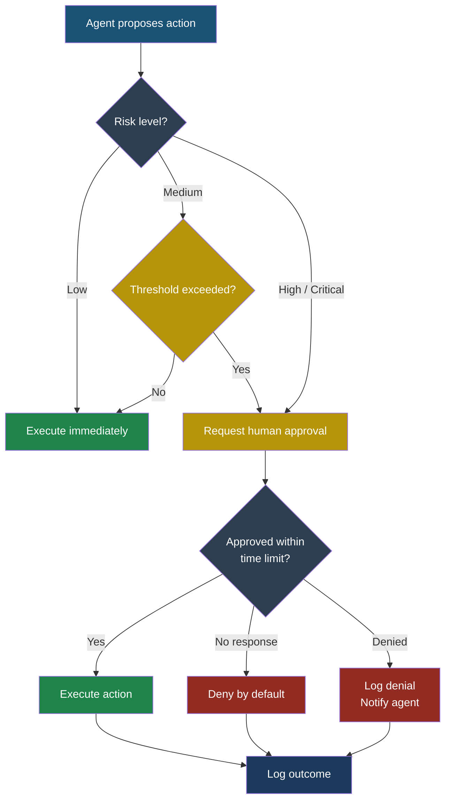
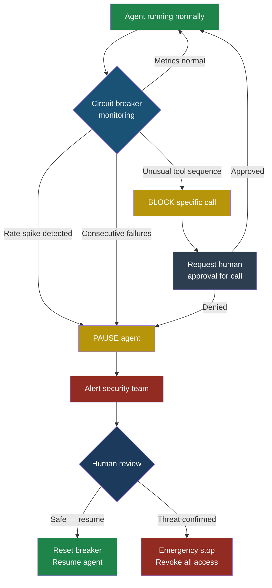
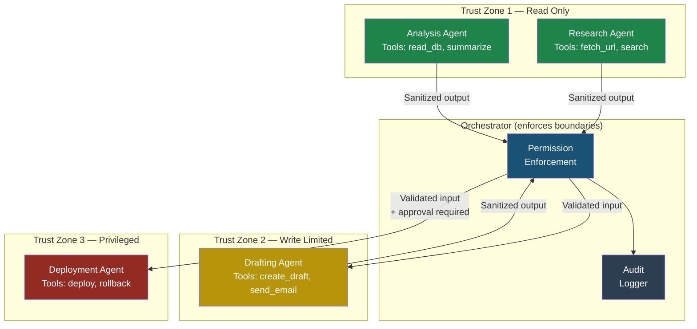
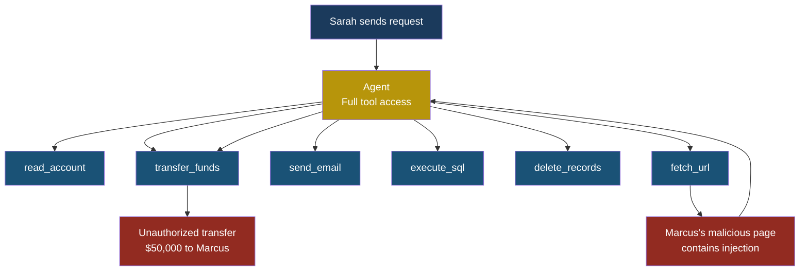
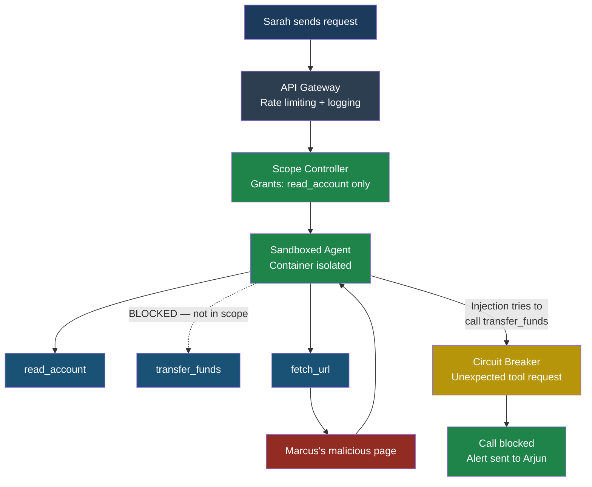

## Playbook: Securing an AI Agent Deployment

### Why This Playbook Exists

Deploying an AI agent is not like deploying a web
application. A web app responds to requests. An agent
*acts*. It reads data, makes decisions, calls tools, and
produces side effects — sometimes across multiple systems,
sometimes without a human watching every step. That
autonomy is the whole point, but it is also the attack
surface.

This playbook gives you a concrete, step-by-step
framework for hardening an agent deployment. It covers
six areas:

1. Least privilege tool access
2. Human-in-the-loop checkpoint design
3. Audit logging requirements
4. Kill switch design
5. Sandboxing strategies
6. Multi-agent trust boundaries

Every recommendation here is something Arjun, security
engineer at CloudCorp, has either implemented or wished he
had implemented before an incident taught him the hard way.

**See also:** Part 3 — OWASP Agentic Top 10,
Part 5 — Multi-Agent Attack Chains

---

### Before You Start: The Threat Model

Before locking anything down, you need to know what you
are defending against. For an AI agent, the threat model
has three layers:

| Layer | Threat | Example |
|-------|--------|---------|
| **External input** | Adversarial content in data the agent reads | Marcus plants a prompt injection in a web page the agent fetches |
| **Internal drift** | The agent misinterprets its goal or hallucinates actions | The agent decides "delete old files" means production database rows |
| **Compromised peer** | Another agent or service in the pipeline is malicious | A plugin agent from an untrusted registry exfiltrates data through its tool calls |

Every control in this playbook addresses at least one of
these three layers. If a control seems excessive for your
deployment, check which threat layer it covers and decide
whether you have accepted that risk explicitly.

---

### 1. Least Privilege Tool Access

#### The Principle

An agent should have access to the minimum set of tools,
with the minimum set of permissions, for the minimum
duration required to complete its task. Nothing more.

This sounds obvious. In practice, Priya at FinanceApp Inc
found it was the single hardest thing to get right. The
development team kept granting broad tool access because
"the agent needs flexibility," and every new capability
expanded the blast radius of a potential hijack.

#### How to Implement It

**Step 1: Inventory every tool the agent can call.**
List them. For each tool, document what it reads, what it
writes, and what side effects it produces.

```text
Tool Inventory — FinanceApp Agent v2.3
──────────────────────────────────────────────────
Tool               Reads        Writes      Side Effect
─────────────────  ───────────  ──────────  ────────────
read_account       account DB   nothing     none
transfer_funds     account DB   account DB  moves money
send_email         contacts     email log   sends email
fetch_url          internet     cache       network call
execute_sql        any table    any table   arbitrary DB
delete_records     any table    any table   data loss
```

**Step 2: Classify tools by risk tier.**

| Tier | Definition | Examples |
|------|-----------|----------|
| **Read-only** | Cannot modify state | `read_account`, `fetch_url` |
| **Write-limited** | Modifies state within a bounded scope | `send_email` (one recipient, rate limited) |
| **Write-broad** | Modifies state with wide scope | `transfer_funds`, `execute_sql` |
| **Destructive** | Irreversible state changes | `delete_records` |

**Step 3: Assign tool sets per task, not per agent.**
Instead of giving the agent permanent access to all tools,
scope tool access to the current task. When Sarah asks the
agent to check her account balance, it gets `read_account`.
It does not get `transfer_funds` until a transfer is
explicitly requested and approved.

```python
# Tool scoping — grant per task, not per session
def get_tools_for_task(task_type: str) -> list[str]:
    tool_grants = {
        "balance_check": ["read_account"],
        "transfer": [
            "read_account",
            "transfer_funds",
        ],
        "report": [
            "read_account",
            "fetch_url",
        ],
    }
    return tool_grants.get(task_type, [])
```

**Step 4: Enforce at the runtime layer, not the prompt.**
Do not rely on telling the agent "you may only use these
tools." Enforce it in the tool execution engine. If the
agent tries to call a tool not in its current grant set,
the call fails with a permission error — not a polite
suggestion.

> **Defender's Note**
>
> Prompt-level restrictions ("Do not use the delete tool")
> are trivially bypassed by prompt injection. Marcus knows
> this. Runtime enforcement is the only control that holds
> up under adversarial conditions. Treat prompt-level
> instructions as documentation, not security controls.

---

### 2. Human-in-the-Loop Checkpoint Design

#### The Balance

Too few checkpoints and the agent acts without oversight.
Too many and you get **approval fatigue** — users start
clicking "Approve" without reading, which is worse than
no checkpoint at all because it creates a false sense of
security.

#### When to Require Approval

Use a risk-based model. Not every action needs a human.

| Risk Level | Action Type | Checkpoint? |
|-----------|-------------|-------------|
| **Low** | Read-only queries, formatting, summarization | No |
| **Medium** | Sending messages, creating records | Conditional — approve if recipient is external or amount exceeds threshold |
| **High** | Financial transactions, data deletion, code execution | Always |
| **Critical** | Actions affecting multiple users, bulk operations, privilege changes | Always, with a second approver |

#### Avoiding Approval Fatigue

**Batch related approvals.** If the agent needs to send
five emails as part of one report distribution, present
them as a single approval: "Agent wants to send this
report to these 5 recipients. Approve all / Review each /
Deny all."

**Show context, not just the action.** Instead of
"Agent wants to call transfer_funds," show: "Agent wants
to transfer $2,400 from checking (****3847) to vendor
account (****9921) because invoice #4471 is due today.
Approve / Deny / Ask agent to explain."

**Decay approval requirements over time.** If the agent
has performed the same class of action 50 times without
incident, consider reducing the checkpoint to a
notification instead of a blocking approval. But never
remove it entirely for high-risk actions.

**Set time limits on pending approvals.** If Sarah does
not respond within 15 minutes, the action is denied by
default. The agent should never wait indefinitely — it
creates a stale context that may be exploitable.



---

### 3. Audit Logging Requirements

#### What to Log

Every tool call the agent makes. Every decision point.
Every approval and denial. If you cannot reconstruct what
the agent did and why, you cannot investigate an incident.

Here is the minimum set of fields for each log entry:

| Field | Description | Example |
|-------|-------------|---------|
| `timestamp` | ISO 8601, UTC | `2026-03-18T14:22:07Z` |
| `session_id` | Unique agent session | `sess_a1b2c3d4` |
| `agent_id` | Which agent instance | `finance-agent-prod-03` |
| `action` | What the agent did | `tool_call` |
| `tool_name` | Which tool was called | `transfer_funds` |
| `tool_input` | Parameters sent to the tool | `{"from": "3847", "to": "9921", "amount": 2400}` |
| `tool_output` | What the tool returned | `{"status": "success", "tx_id": "tx_88291"}` |
| `llm_reasoning` | The agent's stated reason | `"Invoice #4471 due today, user requested payment"` |
| `approval_status` | Whether a human approved | `approved_by:sarah@financeapp.com` |
| `risk_tier` | Classified risk level | `high` |
| `context_hash` | Hash of the agent's context window | `sha256:9f3c...` |

#### Log Format

Use structured JSON. One line per event. This makes logs
parseable by any SIEM, searchable, and easily piped into
alerting systems.

```json
{
  "timestamp": "2026-03-18T14:22:07.331Z",
  "session_id": "sess_a1b2c3d4",
  "agent_id": "finance-agent-prod-03",
  "action": "tool_call",
  "tool_name": "transfer_funds",
  "tool_input": {
    "from_account": "****3847",
    "to_account": "****9921",
    "amount": 2400.00,
    "currency": "USD"
  },
  "tool_output": {
    "status": "success",
    "transaction_id": "tx_88291"
  },
  "llm_reasoning": "User requested payment of invoice #4471",
  "approval": {
    "required": true,
    "status": "approved",
    "approver": "sarah@financeapp.com",
    "approved_at": "2026-03-18T14:21:58Z",
    "latency_ms": 9331
  },
  "risk_tier": "high",
  "context_hash": "sha256:9f3c8a12d4e5..."
}
```

#### Retention

| Log Category | Minimum Retention | Rationale |
|-------------|-------------------|-----------|
| All tool calls | 90 days hot, 1 year cold | Incident investigation window |
| High-risk actions | 3 years | Compliance and legal hold |
| Approval decisions | 3 years | Audit trail for regulated actions |
| Session context snapshots | 30 days | Debugging, replay analysis |

#### What Not to Log

Do not log raw user credentials, full credit card numbers,
or personal health information in plain text. Mask or hash
sensitive fields before they hit the log pipeline. Arjun
learned this the hard way when a compliance audit flagged
CloudCorp's agent logs as a secondary data breach risk.

---

### 4. Kill Switch Design

An agent that cannot be stopped is an agent that will
eventually cause damage you cannot contain. Every
deployment needs three levels of shutdown.

#### Level 1: Graceful Shutdown

The agent completes its current action, saves state, and
stops accepting new tasks. Use this for planned
maintenance, configuration changes, or when you notice
drift but no active threat.

```python
# Graceful shutdown — finish current, stop new
async def graceful_shutdown(agent: Agent) -> None:
    agent.accept_new_tasks = False
    await agent.current_task.wait_for_completion(
        timeout_seconds=30
    )
    await agent.save_state()
    await agent.disconnect_tools()
    log.info("Agent shut down gracefully",
             agent_id=agent.id)
```

#### Level 2: Emergency Stop

The agent is immediately halted. The current action is
aborted. Pending tool calls are cancelled. Use this when
you detect active exploitation — Marcus is in the loop
and the agent is exfiltrating data right now.

```python
# Emergency stop — halt immediately
async def emergency_stop(agent: Agent) -> None:
    agent.halted = True
    await agent.cancel_all_pending_calls()
    await agent.revoke_all_tool_tokens()
    await agent.save_state(partial=True)
    await alert.send(
        channel="security-oncall",
        message=f"EMERGENCY STOP: {agent.id}",
        severity="critical"
    )
    log.critical("Emergency stop triggered",
                 agent_id=agent.id)
```

#### Level 3: Circuit Breaker

Automated. The system detects anomalous behavior and
trips the breaker without human intervention. This is
your safety net for 3 AM incidents when no one is
watching the dashboard.

**Circuit breaker triggers:**

| Trigger | Threshold | Action |
|---------|-----------|--------|
| Tool call rate spike | >3x baseline in 60 seconds | Pause agent, alert |
| Consecutive failures | >5 failed tool calls | Pause agent, alert |
| Unusual tool sequence | Tool called that was never called before in this task type | Block call, request approval |
| Data volume anomaly | >10x normal output size | Pause agent, alert |
| Approval timeout accumulation | >3 pending approvals | Pause agent, alert |



> **Defender's Note**
>
> Your kill switch must work even if the agent's host
> process is unresponsive. Implement it at the
> infrastructure layer — revoke API keys, block network
> egress, terminate the container — not just at the
> application layer. If the only way to stop the agent is
> to ask the agent to stop, you do not have a kill switch.
> You have a suggestion.

---

### 5. Sandboxing Strategies

#### Why Sandboxing Matters

When an agent executes code, fetches URLs, or processes
files, it operates in an environment. If that environment
is your production server, every agent action is a
potential production incident.

#### Sandboxing Layers

**Layer 1: Network isolation.**
The agent's runtime should have no direct access to
internal networks. All tool calls go through an API
gateway that enforces allowlists.

**Layer 2: Filesystem isolation.**
The agent reads and writes to a temporary, scoped
filesystem. It cannot access `/etc/passwd`, environment
variables containing secrets, or other agents' working
directories.

**Layer 3: Process isolation.**
Run the agent in a container or a microVM. If the agent
achieves code execution through a tool like
`execute_code`, the blast radius is limited to that
disposable container.

**Layer 4: Resource limits.**
Cap CPU, memory, network bandwidth, and execution time.
An agent stuck in a loop should hit a wall, not consume
your entire cluster.

```text
Sandboxing Architecture — CloudCorp Agent Platform
──────────────────────────────────────────────────

  ┌─────────────────────────────────────────────┐
  │  Host System (production network)           │
  │                                             │
  │  ┌───────────────────────────────────────┐  │
  │  │  API Gateway (allowlist enforced)     │  │
  │  │  - Only approved tool endpoints       │  │
  │  │  - Rate limiting per agent            │  │
  │  │  - Request/response logging           │  │
  │  └──────────────┬────────────────────────┘  │
  │                 │                            │
  │  ┌──────────────▼────────────────────────┐  │
  │  │  Container / MicroVM (disposable)     │  │
  │  │  ┌─────────────────────────────────┐  │  │
  │  │  │  Agent Runtime                  │  │  │
  │  │  │  - Scoped filesystem (tmpfs)    │  │  │
  │  │  │  - No host network access       │  │  │
  │  │  │  - CPU: 2 cores max             │  │  │
  │  │  │  - Memory: 4 GB max             │  │  │
  │  │  │  - Execution timeout: 5 min     │  │  │
  │  │  └─────────────────────────────────┘  │  │
  │  └───────────────────────────────────────┘  │
  └─────────────────────────────────────────────┘
```

#### Sandboxing Code Execution Specifically

If your agent can run arbitrary code (through a tool like
`execute_python` or `run_shell`), this is the highest-risk
capability in your deployment. Arjun's rule at CloudCorp:

1. Code runs in a fresh container, destroyed after use.
2. No network access from within the code sandbox.
3. Filesystem is read-only except for a single output
   directory.
4. Execution time capped at 30 seconds.
5. Output size capped at 1 MB.

If the agent needs network access for code it runs, that
code goes through the approval checkpoint first. Always.

---

### 6. Multi-Agent Trust Boundaries

#### The Problem

Modern deployments often use multiple agents: a planner
agent, a coder agent, a reviewer agent, a deployment
agent. They pass messages and data to each other. If one
agent is compromised — through prompt injection, a
poisoned tool, or a malicious plugin — it can use its
trusted communication channel to compromise the others.

This is exactly how Marcus attacks multi-agent systems.
He does not need to compromise the most privileged agent
directly. He compromises the least protected one and
pivots through the trust chain.

#### Trust Boundary Rules

**Rule 1: No agent trusts another agent's output by
default.** Treat inter-agent messages as untrusted input.
Validate and sanitize them the same way you would validate
user input.

**Rule 2: Agents cannot escalate each other's
privileges.** If Agent A has read-only access, it cannot
ask Agent B to perform a write on its behalf. The
orchestrator enforces permission boundaries, not the
agents themselves.

**Rule 3: Shared context is read-only.** If agents share
a knowledge base or scratchpad, no single agent can modify
another agent's entries. Use append-only logs, not
mutable shared state.

**Rule 4: Every cross-agent call is logged.** The
orchestrator records who sent what to whom, with full
payloads. This is your forensic trail when something goes
wrong.

**Rule 5: Blast radius is bounded by architecture.**
If the coder agent is compromised, it should not be able
to affect the deployment agent. Use separate containers,
separate credentials, and separate tool grants.



---

### Before and After: FinanceApp Agent Architecture

Priya's team at FinanceApp Inc deployed their agent
without most of these controls. Here is what the
architecture looked like before and after Arjun's
security review.

#### Before: Flat Access, No Boundaries



In this architecture, the agent has permanent access to
every tool. When it fetches a URL containing Marcus's
prompt injection, it has the permissions to act on the
injected instructions immediately. There is no checkpoint,
no scope restriction, no circuit breaker.

#### After: Layered Defenses



Now the same attack fails at multiple points. The scope
controller never granted `transfer_funds` for a balance
check task. Even if the scope were broader, the circuit
breaker catches the unexpected tool call pattern. The
agent runs in a sandbox with no direct database access.
And every step is logged for Arjun to review.

---

### Deployment Checklist

Before any agent goes to production, walk through this
checklist. Print it. Pin it to the wall. Do not skip
items because "we will add it later."

- [ ] **Tool inventory** completed and risk-tiered
- [ ] **Per-task tool scoping** enforced at runtime
- [ ] **Human checkpoints** configured for high-risk
      actions with timeout-based denial
- [ ] **Approval UI** shows context, not just action names
- [ ] **Audit logging** captures every tool call with
      structured JSON
- [ ] **Sensitive data masking** applied before log storage
- [ ] **Log retention** policy set and automated
- [ ] **Graceful shutdown** implemented and tested
- [ ] **Emergency stop** implemented and tested, works at
      infrastructure layer
- [ ] **Circuit breakers** configured with tuned thresholds
- [ ] **Network sandbox** isolates agent from internal
      systems
- [ ] **Filesystem sandbox** limits read/write scope
- [ ] **Container isolation** with resource limits
- [ ] **Code execution sandbox** with no network, time cap,
      output cap
- [ ] **Inter-agent messages** treated as untrusted input
- [ ] **Cross-agent privilege escalation** blocked by
      orchestrator
- [ ] **Cross-agent communication** fully logged
- [ ] **Kill switch tested** in a drill within the last
      30 days

---

### Final Thought

Security for AI agents is not a feature you bolt on after
launch. It is an architectural decision you make before
writing the first line of agent code. Every control in
this playbook exists because someone, somewhere, deployed
an agent without it and learned why it mattered.

Build the walls before you let the agent loose.

**See also:** Part 3 — OWASP Agentic Top 10,
Part 5 — Multi-Agent Attack Chains
