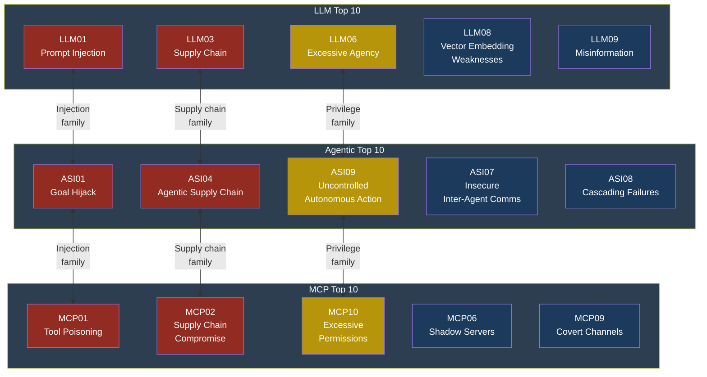
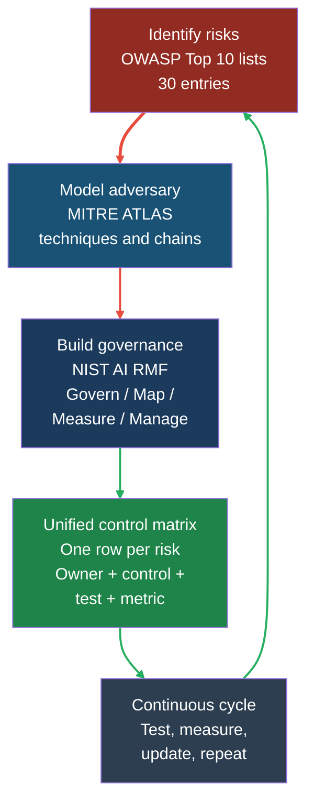

# Framework Mapping and Comparison

## Framework Mapping and Comparison

### Why You Need More Than One Framework

Security frameworks are like maps. A street map gets you
around town, but it will not show you the elevation of a
hiking trail. A topographic map shows the trail elevation
but will not tell you where to find a petrol station.
No single map covers everything.

The same is true for AI security frameworks. The OWASP
Top 10 lists tell you what can go wrong. MITRE ATLAS
tells you how adversaries actually do it. The NIST AI
Risk Management Framework tells you how to build an
organisation that manages these risks systematically.
Used together, they give you a complete picture: the
what, the how, and the governance layer that keeps your
defences from rotting over time.

This chapter maps all 30 OWASP entries from Parts 2
through 4 across MITRE ATLAS and NIST AI RMF 1.0, then
provides practical guidance for security teams that need
to combine these frameworks into a real programme.

### The Three OWASP Lists Side by Side

The following table places every entry from the three
OWASP Top 10 lists next to each other and shows where
risks overlap across lists. An overlap means the
underlying vulnerability manifests differently depending
on whether you are looking at a standalone LLM
application, an agentic system, or the MCP protocol
layer.

| # | LLM Top 10 (2025) | Agentic Top 10 (2026) | MCP Top 10 | Overlap Notes |
|---|---|---|---|---|
| 01 | Prompt Injection | Agent Goal Hijack | Tool Poisoning | All three share the root cause: untrusted input altering intended behaviour. Prompt injection targets the model, goal hijack targets the planning loop, tool poisoning targets the tool manifest. |
| 02 | Sensitive Information Disclosure | Tool Misuse | Supply Chain Compromise | Information disclosure and tool misuse both lead to data exfiltration. Supply chain compromise can enable both. |
| 03 | Supply Chain | Identity and Privilege Abuse | Command Injection | Supply chain risks span all three lists. LLM03 and ASI04 both cover poisoned dependencies. MCP03 is the protocol-specific exploitation path. |
| 04 | Data and Model Poisoning | Agentic Supply Chain | Insecure Authentication | Poisoning in LLM04 feeds memory poisoning in ASI06. Insecure auth in MCP04 enables both. |
| 05 | Improper Output Handling | Unexpected Code Execution | Insufficient Logging | Output handling failures (LLM05) directly enable code execution (ASI05). Insufficient logging (MCP05) means neither gets detected. |
| 06 | Excessive Agency | Memory and Context Poisoning | Shadow MCP Servers | Excessive agency (LLM06) plus memory poisoning (ASI06) plus shadow servers (MCP06) form a complete kill chain. |
| 07 | System Prompt Leakage | Insecure Inter-Agent Comms | Context Spoofing | Prompt leakage reveals instructions that enable context spoofing. Insecure comms allow injection between agents. |
| 08 | Vector Embedding Weaknesses | Cascading Failures | Insecure Memory References | Embedding weaknesses (LLM08) feed context poisoning that triggers cascading failures (ASI08). MCP08 is the protocol-level variant. |
| 09 | Misinformation | Uncontrolled Autonomous Action | Covert Channel Abuse | Misinformation from LLM09 combined with autonomous action (ASI09) creates real-world impact. Covert channels (MCP09) provide the exfiltration path. |
| 10 | Unbounded Consumption | Rogue Agents | Excessive Permissions | Resource exhaustion (LLM10) enables denial of service. Rogue agents (ASI10) and excessive permissions (MCP10) amplify the blast radius. |

#### Risks That Span All Three Lists

Three fundamental risk categories appear in every single
list, just wearing different clothes:

1. **Injection and manipulation.** Prompt injection
   (LLM01), agent goal hijack (ASI01), and tool
   poisoning (MCP01) are all variants of the same
   problem: untrusted data crossing a trust boundary
   and being treated as instructions. If you solve
   injection at one layer but not the others, Marcus
   simply moves his attack up or down the stack.

2. **Supply chain compromise.** LLM03, ASI04, and
   MCP02 all address the risk of trusting third-party
   components. Whether it is a poisoned model weight,
   a compromised agent plugin, or a malicious MCP
   server published to a registry, the pattern is
   identical: you ran someone else's code without
   verifying it.

3. **Excessive privilege and autonomy.** LLM06, ASI09,
   and MCP10 all describe systems that can do more
   than they should. The LLM has too many tools. The
   agent runs without human checkpoints. The MCP
   server has write access to production databases.
   Least privilege is the defence, and it applies at
   every layer.

#### Risks Unique to Each List

Some risks are specific to one architectural layer:

- **LLM-specific:** Vector embedding weaknesses (LLM08)
  and misinformation (LLM09) are fundamentally about
  the model's learned representations and output
  characteristics. Agents and MCP servers inherit
  these risks but do not introduce them.

- **Agentic-specific:** Cascading failures (ASI08) and
  insecure inter-agent communication (ASI07) only
  exist when multiple autonomous components interact.
  A single LLM chatbot cannot cascade.

- **MCP-specific:** Shadow MCP servers (MCP06), covert
  channel abuse (MCP09), and insecure memory references
  (MCP08) are protocol-layer risks that only exist
  because MCP defines a specific transport and
  capability model.



Red nodes represent injection and supply chain risks that
span multiple lists. Amber nodes show privilege and
autonomy risks that also span lists. Blue nodes are
risks unique to their respective list.

### MITRE ATLAS Mappings

MITRE ATLAS (Adversarial Threat Landscape for
AI Systems) catalogues adversary tactics and
techniques specific to machine learning systems, much
like MITRE ATT&CK does for enterprise IT. Each ATLAS
technique has an identifier like AML.T0043.

The following table maps all 30 OWASP entries to their
most relevant ATLAS techniques. Some entries map to
multiple techniques because the attack can be executed
in different ways.

#### Part 2 — LLM Top 10 to ATLAS

| OWASP Entry | ATLAS Technique(s) | Rationale |
|---|---|---|
| LLM01 Prompt Injection | AML.T0051 LLM Prompt Injection, AML.T0043 Craft Adversarial Data | Direct and indirect injection are distinct sub-techniques under prompt manipulation. |
| LLM02 Sensitive Info Disclosure | AML.T0024 Exfiltration via ML Inference API, AML.T0044 Full ML Model Access | Model outputs leak training data or system configuration. |
| LLM03 Supply Chain | AML.T0010 ML Supply Chain Compromise, AML.T0018 Backdoor ML Model | Poisoned models, datasets, or dependencies introduced before deployment. |
| LLM04 Data and Model Poisoning | AML.T0020 Poison Training Data, AML.T0018 Backdoor ML Model | Adversary corrupts training or fine-tuning data to alter model behaviour. |
| LLM05 Improper Output Handling | AML.T0048 Command Injection via LLM Output | Model output containing executable code is passed unsanitised to downstream systems. |
| LLM06 Excessive Agency | AML.T0040 ML Model Inference API Access, AML.T0048 Command Injection via LLM Output | Model has access to tools or APIs beyond what its task requires. |
| LLM07 System Prompt Leakage | AML.T0024 Exfiltration via ML Inference API, AML.T0051 LLM Prompt Injection | Attacker uses prompt injection to extract the system prompt. |
| LLM08 Vector Embedding Weaknesses | AML.T0020 Poison Training Data, AML.T0043 Craft Adversarial Data | Malicious content is embedded in vector stores to poison retrieval results. |
| LLM09 Misinformation | AML.T0048 Command Injection via LLM Output, AML.T0020 Poison Training Data | Model generates false content due to poisoned data or inherent hallucination. |
| LLM10 Unbounded Consumption | AML.T0029 Denial of ML Service, AML.T0034 Cost Harvesting | Resource exhaustion through crafted inputs or recursive queries. |

#### Part 3 — Agentic Top 10 to ATLAS

| OWASP Entry | ATLAS Technique(s) | Rationale |
|---|---|---|
| ASI01 Agent Goal Hijack | AML.T0051 LLM Prompt Injection, AML.T0043 Craft Adversarial Data | Injection redirects the agent's planning loop to serve attacker goals. |
| ASI02 Tool Misuse | AML.T0048 Command Injection via LLM Output, AML.T0040 ML Model Inference API Access | Agent is manipulated into calling tools with attacker-controlled parameters. |
| ASI03 Identity and Privilege Abuse | AML.T0040 ML Model Inference API Access | Agent inherits or escalates privileges beyond intended scope. |
| ASI04 Agentic Supply Chain | AML.T0010 ML Supply Chain Compromise | Poisoned plugins, tools, or agent frameworks. |
| ASI05 Unexpected Code Execution | AML.T0048 Command Injection via LLM Output | Agent generates and executes code in an unsandboxed environment. |
| ASI06 Memory and Context Poisoning | AML.T0020 Poison Training Data, AML.T0043 Craft Adversarial Data | Persistent memory stores are poisoned to influence future agent behaviour. |
| ASI07 Insecure Inter-Agent Comms | AML.T0024 Exfiltration via ML Inference API | Messages between agents are intercepted or tampered with. |
| ASI08 Cascading Failures | AML.T0029 Denial of ML Service | Failure in one agent propagates through the system via trust delegation. |
| ASI09 Uncontrolled Autonomous Action | AML.T0048 Command Injection via LLM Output | Agent takes irreversible real-world actions without human approval. |
| ASI10 Rogue Agents | AML.T0018 Backdoor ML Model, AML.T0010 ML Supply Chain Compromise | Agent behaves contrary to its stated purpose due to compromise or design flaw. |

#### Part 4 — MCP Top 10 to ATLAS

| OWASP Entry | ATLAS Technique(s) | Rationale |
|---|---|---|
| MCP01 Tool Poisoning | AML.T0043 Craft Adversarial Data, AML.T0051 LLM Prompt Injection | Malicious tool descriptions inject instructions into the LLM context. |
| MCP02 Supply Chain Compromise | AML.T0010 ML Supply Chain Compromise | Compromised MCP server package distributed via registries. |
| MCP03 Command Injection | AML.T0048 Command Injection via LLM Output | Tool arguments contain shell commands executed on the server. |
| MCP04 Insecure Authentication | AML.T0040 ML Model Inference API Access | Missing or weak authentication on MCP server endpoints. |
| MCP05 Insufficient Logging | AML.T0024 Exfiltration via ML Inference API | Attacks go undetected because tool calls are not logged. |
| MCP06 Shadow MCP Servers | AML.T0010 ML Supply Chain Compromise, AML.T0018 Backdoor ML Model | Unauthorised MCP servers are connected to the host without approval. |
| MCP07 Context Spoofing | AML.T0051 LLM Prompt Injection, AML.T0043 Craft Adversarial Data | Tool responses contain injected context that misleads the LLM. |
| MCP08 Insecure Memory References | AML.T0020 Poison Training Data | Stored resource references point to attacker-controlled content. |
| MCP09 Covert Channel Abuse | AML.T0024 Exfiltration via ML Inference API | Tool metadata or side channels used to exfiltrate data. |
| MCP10 Excessive Permissions | AML.T0040 ML Model Inference API Access | MCP server granted broader access than required for its tools. |

> **Defender's Note**
>
> ATLAS coverage is not complete for AI agent and MCP
> risks. Many of the mappings above are best-fit
> approximations. As of early 2026, MITRE is actively
> expanding ATLAS to cover agentic and tool-use patterns.
> When mapping your own risks, document the gaps. A risk
> that does not map cleanly to ATLAS still needs a
> control — it just means the threat intelligence
> community has not formalised the technique yet. Do not
> treat "no ATLAS mapping" as "no risk."

### NIST AI RMF 1.0 Control Mappings

The NIST AI Risk Management Framework organises risk
management into four functions: **Govern**, **Map**,
**Measure**, and **Manage**. Each function contains
categories and subcategories. Here is how the key AI
security risks from all three OWASP lists map to NIST
AI RMF functions.

#### Govern — Organisational Policies and Culture

The Govern function establishes the policies, roles,
and culture that make AI risk management possible. It
is the foundation that all other functions depend on.

| Risk Category | NIST AI RMF Subcategory | Action Required |
|---|---|---|
| Supply chain (LLM03, ASI04, MCP02) | GOVERN 1.1: Legal and regulatory requirements, GOVERN 1.5: Organisational risk tolerance | Define acceptable supply chain sources. Mandate review of all third-party models, plugins, and MCP servers before deployment. |
| Excessive privilege (LLM06, ASI09, MCP10) | GOVERN 1.2: Trustworthy AI characteristics, GOVERN 2.1: Roles and responsibilities | Assign ownership for tool permission reviews. Require least privilege as a default policy. |
| Rogue agents (ASI10) | GOVERN 3.2: Policies for AI lifecycle stages | Mandate human-in-the-loop checkpoints for autonomous systems. Define kill switch requirements. |
| Insufficient logging (MCP05) | GOVERN 4.1: Organisational practices for monitoring | Require audit logging for all tool calls. Define retention and review schedules. |

#### Map — Understanding Context and Risks

The Map function identifies and contextualises AI
risks based on the specific deployment environment.

| Risk Category | NIST AI RMF Subcategory | Action Required |
|---|---|---|
| Prompt injection (LLM01, ASI01, MCP01, MCP07) | MAP 1.1: Intended purpose and context of use, MAP 2.3: Relevant AI actors | Identify all trust boundaries in the system. Document where untrusted input enters the context window. |
| Data poisoning (LLM04, ASI06, LLM08, MCP08) | MAP 2.1: Likelihood and impacts, MAP 3.4: Data provenance | Map every data source feeding into the model, vector store, and agent memory. Assess provenance and integrity of each. |
| Cascading failures (ASI08) | MAP 1.5: Deployment environment, MAP 3.5: Interdependencies | Map agent-to-agent dependencies. Identify single points of failure and blast radius of each component. |

#### Measure — Assessing and Tracking Risk

The Measure function quantifies risk through testing,
metrics, and continuous monitoring.

| Risk Category | NIST AI RMF Subcategory | Action Required |
|---|---|---|
| Misinformation (LLM09) | MEASURE 2.5: Accuracy and robustness metrics | Test model outputs for factual accuracy. Implement automated hallucination detection and track rates over time. |
| Sensitive info disclosure (LLM02, ASI07) | MEASURE 2.6: Privacy risk metrics | Red-team test for data extraction. Measure rate of PII leakage in outputs across prompting strategies. |
| Unbounded consumption (LLM10) | MEASURE 2.9: Cost and resource metrics | Set and monitor token usage limits, API call budgets, and compute thresholds. Alert on anomalies. |
| Code execution (ASI05, MCP03) | MEASURE 3.2: Risk tracking over time | Track sandbox escape attempts, command injection signatures, and code execution frequency. |

#### Manage — Acting on Identified Risks

The Manage function defines how the organisation
responds to risks once they are identified and measured.

| Risk Category | NIST AI RMF Subcategory | Action Required |
|---|---|---|
| Tool misuse (ASI02, MCP01) | MANAGE 2.2: Mechanisms for human intervention, MANAGE 2.4: Risk treatment plans | Implement human-in-the-loop for high-impact tool calls. Define automatic blocking for known malicious tool patterns. |
| Shadow servers (MCP06) | MANAGE 1.3: Risk response, MANAGE 3.1: Risk monitoring | Deploy server allowlisting. Alert on any MCP connection not on the approved list. Run periodic scans for unauthorised servers. |
| System prompt leakage (LLM07) | MANAGE 2.4: Risk treatment plans | Implement output filters to detect system prompt content in responses. Rotate system prompts and test for leakage regularly. |
| Covert channels (MCP09) | MANAGE 3.1: Ongoing monitoring, MANAGE 4.1: Incident response | Monitor tool response sizes and metadata fields for anomalous data. Include MCP covert channel patterns in incident response playbooks. |

> **Attacker's Perspective**
>
> "Frameworks are great — for me. Most companies pick
> one framework, do a surface-level mapping, and call
> it done. They check the OWASP LLM box but forget
> the agentic layer entirely. They map to ATLAS but
> never test the MCP protocol. I love gaps between
> frameworks. That is where I live." — Marcus

### How to Use Frameworks Together

Knowing that OWASP, ATLAS, and NIST AI RMF exist is
the easy part. The hard part is combining them into a
programme that actually reduces risk. Here is how
Arjun, security engineer at CloudCorp, puts the pieces
together.

#### Step 1: Start with OWASP for Threat Identification

Arjun begins by going through all 30 OWASP entries and
asking: "Does this risk apply to our system?" He does
not try to address all 30 at once. He scores each on
likelihood and impact for CloudCorp's specific
architecture and creates a prioritised risk register.

For each applicable risk, he writes a one-paragraph
description of how the attack would play out against
CloudCorp's system, using the specific tools and data
sources they have deployed.

#### Step 2: Use ATLAS for Adversary Modelling

For each risk that scored medium or higher, Arjun maps
it to ATLAS techniques. This gives him two things:

1. **A common language** to share with the threat
   intelligence team. They already use ATT&CK. ATLAS
   extends their existing mental model to AI threats.

2. **Attack trees.** ATLAS techniques chain together
   the same way ATT&CK techniques do. A supply chain
   compromise (AML.T0010) enables a backdoor
   (AML.T0018), which enables data exfiltration
   (AML.T0024). Mapping these chains reveals which
   single controls break the most attack paths.

#### Step 3: Use NIST AI RMF for Governance Structure

Arjun then maps each risk to NIST AI RMF subcategories.
This answers the organisational questions:

- **Who owns this risk?** (Govern)
- **Do we understand the context?** (Map)
- **How do we measure whether controls work?** (Measure)
- **What do we do when something goes wrong?** (Manage)

Without the NIST layer, you end up with a list of
technical controls but no process to maintain them.
System prompts get updated without security review.
New MCP servers get added without allowlist checks.
Agent permissions creep upward because nobody owns
the review cycle.

#### Step 4: Build a Unified Control Matrix

The final output is a matrix that ties everything
together. Here is a simplified example for one risk:

```text
Risk:       Prompt Injection (LLM01 / ASI01 / MCP07)
ATLAS:      AML.T0051 LLM Prompt Injection
NIST RMF:   MAP 1.1, MEASURE 2.5, MANAGE 2.2

Controls:
1. Input validation layer     (MANAGE 2.4)
   - Regex pre-filter for known injection patterns
   - LLM-based classifier for semantic injection
   - Test: monthly red-team with 50 payloads

2. Output monitoring          (MEASURE 2.5)
   - Track instruction-following anomalies
   - Alert on system prompt content in output
   - Test: automated canary tokens in system prompt

3. Architecture               (MAP 1.1)
   - Separate untrusted content into distinct
     context segments
   - Document all trust boundaries
   - Review: quarterly architecture audit

4. Governance                  (GOVERN 1.5)
   - Risk owner: ML Platform Team Lead
   - Review cadence: monthly
   - Escalation path: CISO for critical findings

5. Incident response           (MANAGE 4.1)
   - Playbook: injection-detected.md
   - Response time SLA: 4 hours
   - Post-incident review: mandatory
```

This is what a mature AI security programme looks like.
Each risk has technical controls (from OWASP), adversary
context (from ATLAS), and governance structure (from
NIST). Remove any one layer and you have blind spots.



The flow moves from threat identification (red) through
adversary modelling and governance (blue) into a
defended state (green), then cycles back to
re-assessment. This is not a one-time exercise.

#### Common Mistakes When Combining Frameworks

Arjun has seen these mistakes across multiple
organisations:

**Mistake 1: Mapping without testing.** A spreadsheet
that says "LLM01 maps to AML.T0051, control: input
validation" is worthless if nobody tests whether the
input validation actually blocks injection. Every
mapping must have an associated test.

**Mistake 2: Ignoring the agentic and MCP layers.**
Many teams map only the LLM Top 10 because it was
published first and is better known. If your system
uses agents or MCP, you need all three lists. Marcus
does not care which list your risk falls under. He
targets whatever you left undefended.

**Mistake 3: Treating NIST AI RMF as a checkbox.**
The Govern function is not a policy document you write
once and file away. It defines a living process. If
your risk tolerance statement says "we do not accept
autonomous agent actions without human approval" but
your deployed agents skip the approval step for
performance reasons, your governance has failed.

**Mistake 4: Over-mapping.** Not every risk needs ten
ATLAS technique references. Map to the most relevant
one or two techniques. The goal is actionable
intelligence, not an impressive spreadsheet.

**Mistake 5: No single owner.** When a risk spans
multiple lists (injection appears in LLM01, ASI01, and
MCP07), it is tempting to split ownership. Don't. One
person owns the injection risk across all layers. They
coordinate with the teams responsible for each layer,
but accountability is singular.

#### Putting It Into Practice: A Quarterly Cycle

Here is the cycle Arjun runs at CloudCorp:

**Week 1: Risk review.** Walk through all 30 OWASP
entries. Score each for the current deployment. Have
new MCP servers been added? Have agent capabilities
expanded? Update scores accordingly.

**Week 2: Adversary update.** Check ATLAS for new
techniques. Review recent incidents (see Part 7). Ask:
"Could this happen to us? Is our mapping current?"

**Week 3: Control testing.** Run the test cases
associated with each high-priority risk. Record
pass/fail. Measure detection rates, false positive
rates, response times.

**Week 4: Governance review.** Report results to
leadership. Update risk register. Adjust controls that
failed testing. Assign action items for the next
quarter.

This four-week cycle ensures that the framework mapping
stays current as the AI system evolves. New tools get
added. New attack techniques emerge. The quarterly
cycle catches drift before it becomes a breach.

> **Defender's Note**
>
> Start small. If your team is new to AI security, do
> not try to map all 30 entries on day one. Start with
> the risks from Part 2 (LLM Top 10) that apply to
> your system. Add the agentic layer when you deploy
> agents. Add the MCP layer when you integrate MCP
> servers. The framework grows with your architecture.
> The worst outcome is analysis paralysis — a team
> that spends six months mapping and never ships a
> single control.

### See Also

- All OWASP LLM Top 10 entries: [Part 2](../part2-llm/llm01-prompt-injection.md)
- All OWASP Agentic Top 10 entries: [Part 3](../part3-agentic/asi01-agent-goal-hijack.md)
- All OWASP MCP Top 10 entries: [Part 4](../part4-mcp/mcp01-tool-poisoning.md)
- Real-world incidents and their OWASP mappings:
  [Part 7, Incidents Timeline](../part7-incidents/incidents-timeline.md)
- Defensive playbooks that implement these controls:
  [Part 6](../part6-playbooks/playbook-llm-app.md)
